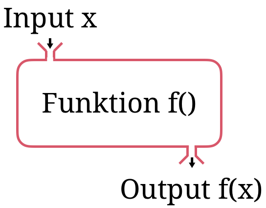
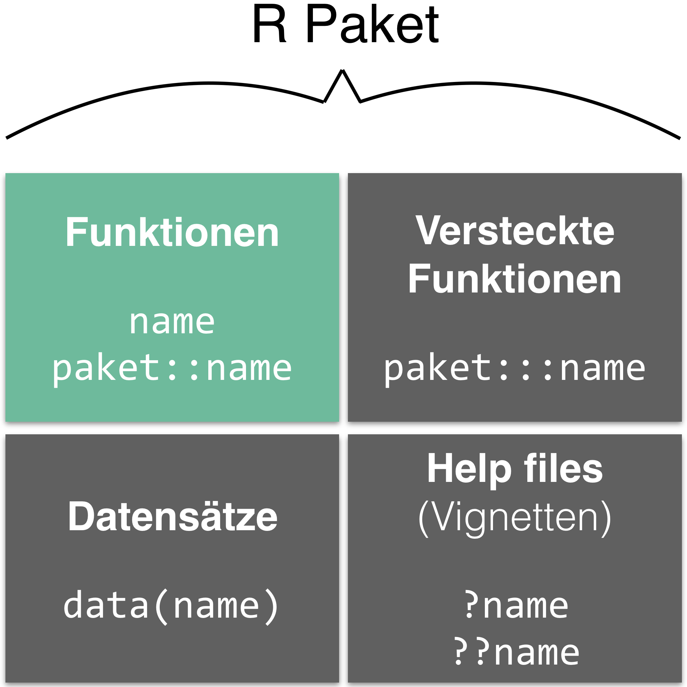

layout: true

<div class="my-footer">
  <span style="text-align:center">
    <span> 
      
    </span>
    <a href="https://therbootcamp.github.io/">
      <span style="padding-left:82px"> 
        <font color="#7E7E7E">
          www.therbootcamp.com
        </font>
      </span>
    </a>
    <a href="https://therbootcamp.github.io/">
      <font color="#7E7E7E">
      Einführung in die moderne Datenanalyse mit R | August 2021
      </font>
    </a>
    </span>
  </div> 

---

```{r, eval = TRUE, echo = FALSE, warning=F,message=F}
# Code to knit slides
basel <- readr::read_csv("data/basel.txt")
```

```{r setup, include=FALSE}
options(htmltools.dir.version = FALSE)
# see: https://github.com/yihui/xaringan
# install.packages("xaringan")
# see: 
# https://github.com/yihui/xaringan/wiki
# https://github.com/gnab/remark/wiki/Markdown
options(width=110)
options(digits = 4)

require(tidyverse)
```


# Agenda

.pull-left4[

<ul>
  <li class="m1g"><span>R(Studio)</span></li>
  <li class="m2g"><span>Assignments<br></span></li>
  <li class="m3"><span><high>Funktionen</high></span></li>
  <ul class="level">
    <li><span>Alles geschieht durch eine Funktion</span></li>
    <li><span>Funktionen haben (Default) Argumente</span></li>
    <li><span>Die Klasse der Argumente ist wichtig</span></li>
    <li><span>Funktionen "leben" in Paketen</span></li>
    <li><span>Erhalte Hilfe mit <mono>?</span></li>
  </ul><br>
  <li class="m4g"><span>Data I/O</a></span></li>
  <li class="m5g"><span>Analyse</span></li>
</ul>

]

.pull-right5[
<p align = "center">
<br>
<font style="font-size:10px">from <a href="https://xkcd.com//">xkcd.com</a></font>
</p>

]

---

# Funktionen 

.pull-left4[
<ul>
  <li class="m1g"><span>R(Studio)</span></li>
  <li class="m2g"><span>Assignments<br></span></li>
  <li class="m3"><span>Funktionen</span></li>
  <ul class="level">
    <li><span><high>Alles geschieht durch eine Funktion</high></span></li>
    <li><span>Funktionen haben (Default) Argumente</span></li>
    <li><span>Die Klasse der Argumente ist wichtig</span></li>
    <li><span>Funktionen "leben" in Paketen</span></li>
    <li><span>Erhalte Hilfe mit <mono>?</span></li>
  </ul><br>
  <li class="m4g"><span>Data I/O</a></span></li>
  <li class="m5g"><span>Analyse</span></li>
</ul>
]

.pull-right5[
<p align="center"></p>
]

---

# Funktionen 

.pull-left4[
<ul>
  <li class="m1g"><span>R(Studio)</span></li>
  <li class="m2g"><span>Assignments<br></span></li>
  <li class="m3"><span>Funktionen</span></li>
  <ul class="level">
    <li><span><high>Alles geschieht durch eine Funktion</high></span></li>
    <li><span>Funktionen haben (Default) Argumente</span></li>
    <li><span>Die Klasse der Argumente ist wichtig</span></li>
    <li><span>Funktionen "leben" in Paketen</span></li>
    <li><span>Erhalte Hilfe mit <mono>?</span></li>
  </ul><br>
  <li class="m4g"><span>Data I/O</a></span></li>
  <li class="m5g"><span>Analyse</span></li>
</ul>
]

.pull-right5[
```{r}
# Funktion c()
eins_zwei_drei <- c(1, 2, 3)

# Funktion `+`()
eins_zwei_drei + 100

# Funktion print()
eins_zwei_drei

# Funktion mean()
mean(eins_zwei_drei)

```
]


---

# Argumente 

.pull-left4[
<ul>
  <li class="m1g"><span>R(Studio)</span></li>
  <li class="m2g"><span>Assignments<br></span></li>
  <li class="m3"><span>Funktionen</span></li>
  <ul class="level">
    <li><span>Alles geschieht durch eine Funktion</span></li>
    <li><span><high>Funktionen haben (Default) Argumente</high></span></li>
    <li><span>Die Klasse der Argumente ist wichtig</span></li>
    <li><span>Funktionen "leben" in Paketen</span></li>
    <li><span>Erhalte Hilfe mit <mono>?</span></li>
  </ul><br>
  <li class="m4g"><span>Data I/O</a></span></li>
  <li class="m5g"><span>Analyse</span></li>
</ul>
]

.pull-right5[
```{r, error=TRUE,tidy=T}
# Kein Argument
mean()

# Ein (notwendiges) Argument
mean(c(1, 2, 3))

# Hinzufügen eines fehlenden Werts (NA)
mean(c(1, 2, 3, NA))
```
]


---

# Argumente 

.pull-left4[
<ul>
  <li class="m1g"><span>R(Studio)</span></li>
  <li class="m2g"><span>Assignments<br></span></li>
  <li class="m3"><span>Funktionen</span></li>
  <ul class="level">
    <li><span>Alles geschieht durch eine Funktion</span></li>
    <li><span><high>Funktionen haben (Default) Argumente</high></span></li>
    <li><span>Die Klasse der Argumente ist wichtig</span></li>
    <li><span>Funktionen "leben" in Paketen</span></li>
    <li><span>Erhalte Hilfe mit <mono>?</span></li>
  </ul><br>
  <li class="m4g"><span>Data I/O</a></span></li>
  <li class="m5g"><span>Analyse</span></li>
</ul>
]

.pull-right5[
```{r, error=TRUE,tidy=T}
# Kein Argument
mean()

# Ein (notwendiges) Argument
mean(c(1, 2, 3))

# Ändere den Default zur Entfernung des NAs
mean(c(1, 2, 3, NA), na.rm = TRUE)

```
]

---

# Klassen 

.pull-left4[
<ul>
  <li class="m1g"><span>R(Studio)</span></li>
  <li class="m2g"><span>Assignments<br></span></li>
  <li class="m3"><span>Funktionen</span></li>
  <ul class="level">
    <li><span>Alles geschieht durch eine Funktion</span></li>
    <li><span>Funktionen haben (Default) Argumente</span></li>
    <li><span><high>Die Klasse der Argumente ist wichtig</high></span></li>
    <li><span>Funktionen "leben" in Paketen</span></li>
    <li><span>Erhalte Hilfe mit <mono>?</span></li>
  </ul><br>
  <li class="m4g"><span>Data I/O</a></span></li>
  <li class="m5g"><span>Analyse</span></li>
</ul>
]

.pull-right5[

<p align = "center">
<br>
</p>

]


---

# Klassen 

.pull-left4[
<ul>
  <li class="m1g"><span>R(Studio)</span></li>
  <li class="m2g"><span>Assignments<br></span></li>
  <li class="m3"><span>Funktionen</span></li>
  <ul class="level">
    <li><span>Alles geschieht durch eine Funktion</span></li>
    <li><span>Funktionen haben (Default) Argumente</span></li>
    <li><span><high>Die Klasse der Argumente ist wichtig</high></span></li>
    <li><span>Funktionen "leben" in Paketen</span></li>
    <li><span>Erhalte Hilfe mit <mono>?</span></li>
  </ul><br>
  <li class="m4g"><span>Data I/O</a></span></li>
  <li class="m5g"><span>Analyse</span></li>
</ul>
]

.pull-right5[
```{r, error=TRUE,tidy=T}

# Berechne Mittelwert von c(1, 2, 3)
mean(c(1, 2, 3))

# Berechne Mittelwert von c("1", "2", "3")
mean(c("1", "2", "3"))
```
]


---

# Pakete 

.pull-left4[
<ul>
  <li class="m1g"><span>R(Studio)</span></li>
  <li class="m2g"><span>Assignments<br></span></li>
  <li class="m3"><span>Funktionen</span></li>
  <ul class="level">
    <li><span>Alles geschieht durch eine Funktion</span></li>
    <li><span>Funktionen haben (Default) Argumente</span></li>
    <li><span>Die Klasse der Argumente ist wichtig</span></li>
    <li><span><high>Funktionen "leben" in Paketen</high></span></li>
    <li><span>Erhalte Hilfe mit <mono>?</span></li>
  </ul><br>
  <li class="m4g"><span>Data I/O</a></span></li>
  <li class="m5g"><span>Analyse</span></li>
</ul>
]

.pull-right5[
<p align="center"></p>
]

---

# Funktionen 

.pull-left4[
<ul>
  <li class="m1g"><span>R(Studio)</span></li>
  <li class="m2g"><span>Assignments<br></span></li>
  <li class="m3"><span>Funktionen</span></li>
  <ul class="level">
    <li><span>Alles geschieht durch eine Funktion</span></li>
    <li><span>Funktionen haben (Default) Argumente</span></li>
    <li><span>Die Klasse der Argumente ist wichtig</span></li>
    <li><span><high>Funktionen "leben" in Paketen</high></span></li>
    <li><span>Erhalte Hilfe mit <mono>?</span></li>
  </ul><br>
  <li class="m4g"><span>Data I/O</a></span></li>
  <li class="m5g"><span>Analyse</span></li>
</ul>
]

.pull-right5[

<high>Installiere</high> Pakete <high>einmal</high> mit `install.packages()`

```{r, eval = FALSE}
install.packages("tidyverse")
```
<br2>
<high>Lade</high> existierende Pakete <high>jedes mal</high> mit `library()`

```{r, eval = FALSE}
library(tidyverse)
```

<p align="left"></p>
]
---

# Funktionen 

.pull-left4[
<ul>
  <li class="m1g"><span>R(Studio)</span></li>
  <li class="m2g"><span>Assignments<br></span></li>
  <li class="m3"><span>Funktionen</span></li>
  <ul class="level">
    <li><span>Alles geschieht durch eine Funktion</span></li>
    <li><span>Funktionen haben (Default) Argumente</span></li>
    <li><span>Die Klasse der Argumente ist wichtig</span></li>
    <li><span>Funktionen "leben" in Paketen</span></li>
    <li><span><high>Erhalte Hilfe mit <mono>?</high></span></li>
  </ul><br>
  <li class="m4g"><span>Data I/O</a></span></li>
  <li class="m5g"><span>Analyse</span></li>
</ul>
]

.pull-right5[
```{r}
?cor
```
<p align="center"></p>
]

---

class: middle, center

<h1><high>Interactive</high></h1>

