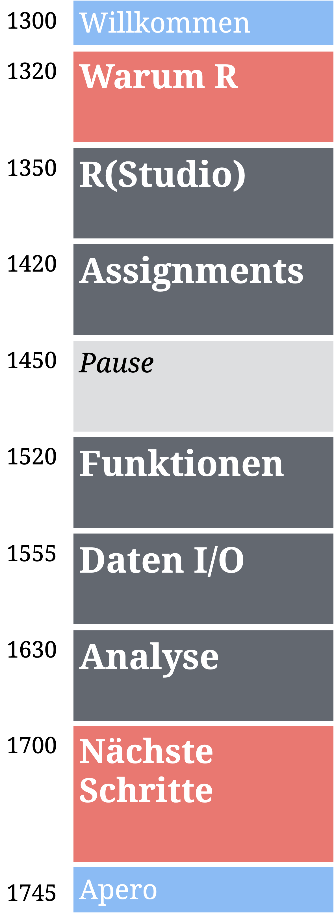
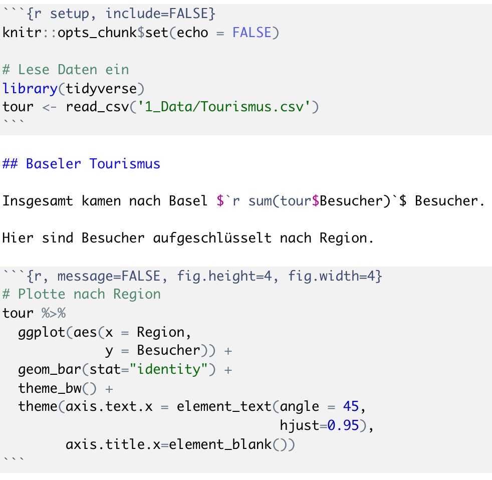
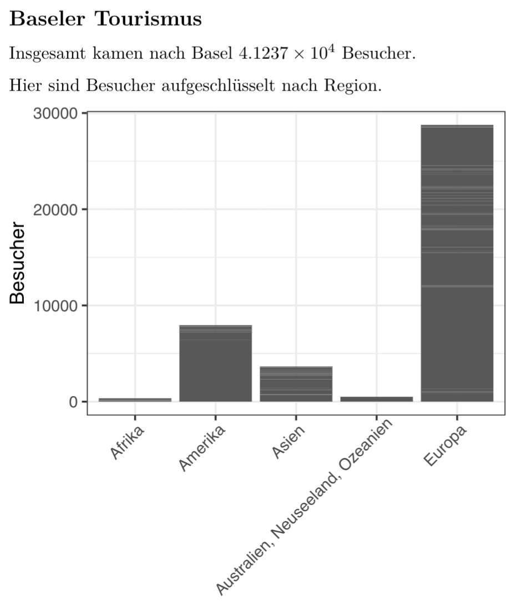

layout: true

<div class="my-footer">
  <span style="text-align:center">
    <span> 
      
    </span>
    <a href="https://therbootcamp.github.io/">
      <span style="padding-left:82px"> 
        <font color="#7E7E7E">
          www.therbootcamp.com
        </font>
      </span>
    </a>
    <a href="https://therbootcamp.github.io/">
      <font color="#7E7E7E">
      Einführung in die moderne Datenanalyse mit R | August 2021
      </font>
    </a>
    </span>
  </div> 

---

```{r setup, include=FALSE}
options(htmltools.dir.version = FALSE)
# see: https://github.com/yihui/xaringan
# install.packages("xaringan")
# see: 
# https://github.com/yihui/xaringan/wiki
# https://github.com/gnab/remark/wiki/Markdown
options(width=110)
options(digits = 4)
```


.pull-left45[

<br><br><br><br><br>

# Hallo Base R Experten

Nach einem Nachmittag kennt Ihr die Grundlagen von R!

]

.pull-right4[


]

---

# R kann viel mehr

.pull-left5[

<font size = 6>

1. `tidyverse` Kern<br>
2. `tidyverse` erweitert<br>
3. Statistik<br>
4. Maschinelles Lernen<br>
5. Reporting<br>

</font>


]


.pull-right5[
<p align="center"></p>
]


---

# `tidyverse` Kern

Das [`tidyverse`](https://www.tidyverse.org/) ist im Kern eine Sammlung hoch-performanter, nutzerfreundlicher Pakete, die speziell für eine effizientere Datenanalyse entwickelt wurden. 
1. `ggplot2` für Grafiken.
2. `dplyr` für Datenverarbeitung.
3. `tidyr` für Datenverarbeitung.
4. `readr` für Daten I/O.
5. `purrr` für funktionales Programmieren.
6. `tibble` für moderne `data.frame`s.
<br><br>

```{r, out.height = "200px", echo = F}
knitr::include_graphics("http://d33wubrfki0l68.cloudfront.net/0ab849ed51b0b866ef6895c253d3899f4926d397/dbf0f/images/hex-ggplot2.png")
knitr::include_graphics("http://d33wubrfki0l68.cloudfront.net/071952491ec4a6a532a3f70ecfa2507af4d341f9/c167c/images/hex-dplyr.png")
knitr::include_graphics("http://d33wubrfki0l68.cloudfront.net/5f8c22ec53a1ac61684f3e8d59c623d09227d6b9/b15de/images/hex-tidyr.png")
knitr::include_graphics("http://d33wubrfki0l68.cloudfront.net/66d3133b4a19949d0b9ddb95fc48da074b69fb07/7dfb6/images/hex-readr.png")
knitr::include_graphics("http://d33wubrfki0l68.cloudfront.net/9221ddead578362bd17bafae5b85935334984429/37a68/images/hex-purrr.png")
knitr::include_graphics("http://d33wubrfki0l68.cloudfront.net/f55c43407ae8944b985e2547fe868e5e2b3f9621/720bb/images/hex-tibble.png")
```

---

# `ggplot2`

.pull-left45[

```{r eval = F, message=F}
library(tidyverse) ; library(ggrepel)

# Lade Tourismus Daten
tour <- read_csv('1_Data/Tourismus.csv') 

# Erstelle Plot mit ggplot2
ggplot(data = tour,
       mapping = aes(x = Besucher, 
                     y = Dauer,
                     label = Land)) +
  scale_x_continuous(trans = 'log2') + 
  geom_point(size=2) 

```

]

.pull-right45[

```{r, echo = F, message=FALSE, warning=F,dpi=300,fig.height=5,fig.width=5.5}
library(tidyverse) ; library(ggrepel)

# Lade Tourismus Daten
tour <- read_csv('1_Data/Tourismus.csv') 

# Plotte Dauer gegen Besucher
ggplot(data = tour,
       mapping = aes(x = Besucher, 
                     y = Dauer,
                     label = Land)) +
  scale_x_continuous(trans = 'log2') + 
  geom_point(size=2) 
```

]


---

# `ggplot2`

.pull-left45[

```{r eval = F, message=F, warning=F}
library(tidyverse) ; library(ggrepel)

# Lade Tourismus Daten
tour <- read_csv('1_Data/Tourismus_18.csv') 

# Plotte Dauer gegen Besucher
ggplot(data = tour,
       mapping = aes(x = Besucher, 
                     y = Dauer,
                     label = Land)) +
  scale_x_continuous(trans = 'log2') + 
  geom_point(size=2) + 
  geom_label_repel(size = 2,
                   label.padding = 0.1) +
  theme_bw() 

```

]

.pull-right45[

```{r, echo = F, message=FALSE, warning=F,dpi=300,fig.height=5,fig.width=5.5}
library(tidyverse) ; library(ggrepel)

# Lade Tourismus Daten
tour <- read_csv('1_Data/Tourismus.csv') 

# Plotte Dauer gegen Besucher
ggplot(data = tour,
       mapping = aes(x = Besucher, 
                     y = Dauer,
                     label = Land)) +
  scale_x_continuous(trans = 'log2') + 
  geom_point(size=2) + 
  geom_label_repel(size = 3,
                   label.padding = 0.1) +
  theme_bw() 
```

]


---

# `ggplot2`

.pull-left45[

```{r eval = F, message=F, warning=F}
library(tidyverse) ; library(ggrepel)

# Lade Tourismus Daten
tour <- read_csv('1_Data/Tourismus.csv') 

# Plotte Dauer gegen Besucher
ggplot(data = tour,
       mapping = aes(x = Besucher, 
                     y = Dauer,
                     label = Land)) +
  scale_x_continuous(trans = 'log2') + 
  geom_point(size=2) + 
  geom_label_repel(size = 2,
                   label.padding = 0.1) +
  theme_bw() +
  facet_grid(Region ~ .)


```

]

.pull-right45[

```{r, echo = F, message=FALSE, warning=F,dpi=300,fig.height=5,fig.width=5.5}
library(tidyverse) ; library(ggrepel)

# Lade Tourismus Daten
tour <- read_csv('1_Data/Tourismus.csv') 

# Plotte Dauer gegen Besucher
ggplot(data = tour,
       mapping = aes(x = Besucher, 
                     y = Dauer,
                     label = Land)) +
  scale_x_continuous(trans = 'log2') + 
  geom_point(size=2) + 
  geom_label_repel(size = 2,
                   label.padding = 0.1) +
  theme_bw() +
  facet_grid(Region ~ .)
```

]

---

# `dplyr`

.pull-left45[

```{r eval = F, message=F, warning=F}
library(tidyverse) 

# Lade Tourismus Daten
tour <- read_csv('1_Data/Tourismus.csv') 

# Zeige Top 10 Länder
tour %>%
  mutate(Nächte = Besucher * Dauer) %>%
  arrange(desc(Nächte)) %>%
  select(Land,  Nächte) %>%
  top_n(10)


```

]

.pull-right45[

```{r, echo = F, message=FALSE,dpi=300,fig.height=5,fig.width=5.5}
# Lade Tourismus Daten
tour <- read_csv('1_Data/Tourismus.csv') 
tour$Region[tour$Region == 'Australien, Neuseeland, Ozeanien'] = 'Australien'

# Zeige Top 10 Länder
tour %>%
  mutate(Nächte = Besucher * Dauer) %>%
  arrange(desc(Nächte)) %>%
  select(Land,  Nächte) %>%
  top_n(10)

```

]

---

# `dplyr`

.pull-left45[

```{r eval = F, message=F}
library(tidyverse) 

# Lade Tourismus Daten
tour <- read_csv('1_Data/Tourismus.csv') 

# Berechne Nächte per Region
tour %>%
  mutate(Nächte = Besucher * Dauer) %>%
  group_by(Region) %>%
  summarize(
    Nächte_mittel = mean(Nächte),
    Nächte_summe = sum(Nächte),    
  )

```

]

.pull-right45[

```{r, echo = F, message=FALSE,dpi=300,fig.height=5,fig.width=5.5}
# Lade Tourismus Daten
tour <- read_csv('1_Data/Tourismus.csv') 
tour$Region[tour$Region == 'Australien, Neuseeland, Ozeanien'] = 'Australien'

# Berechne Nächte per Region
tour %>%
  mutate(Nächte = Besucher * Dauer) %>%
  group_by(Region) %>%
  summarize(
    Nächte_mittel = mean(Nächte),
    Nächte_summe = sum(Nächte),    
  )

```

]

---

# `dplyr`

.pull-left45[

```{r eval = F, message=F}
library(tidyverse) ; library(ggrepel)

# Lade Tourismus Daten
tour <- read_csv('1_Data/Tourismus.csv') 
europa <- read_csv('1_Data/Europa.csv') 

# Verbinde Nächte mit Äquivalenzeinkommen
tour %>%
  mutate(Nächte = Besucher * Dauer) %>%
  left_join(europa) %>%
  ggplot(aes(x = Äquivalenzeinkommen, 
             y = Nächte,
             label = Land)) +
  scale_y_continuous(trans = 'log2') + 
  geom_point() +
  geom_label_repel(size = 2) +
  theme_bw() 

```

]

.pull-right45[

```{r, echo = F, message=FALSE, warning = F, dpi=300,fig.height=5,fig.width=5.5}
library(tidyverse) ; library(ggrepel)

# Lade Tourismus Daten
tour <- read_csv('1_Data/Tourismus.csv') 
europa <- read_csv('1_Data/Europa.csv') 

# Berechne Nächte per Region
tour %>%
  mutate(Nächte = Besucher * Dauer) %>%
  left_join(europa) %>%
  ggplot(aes(x = Äquivalenzeinkommen, 
             y = Nächte,
             label = Land)) +
  scale_y_continuous(trans = 'log2') + 
  geom_point() +
  geom_label_repel(size = 2) +
  theme_bw() 

```

]


---

# `tidyverse` erweitert

Das Umfeld des [`tidyverse`](https://www.tidyverse.org/) beinhaltet eine Sammlung weiterer hoch-performanter, nutzerfreundlicher Pakete, die den tidyverse Kern ergänzen. 
1. `xlm2` für die Verarbeitung von XML und HTML Dateien.
2. `rvest` für Web Scraping.
3. `haven` für SPSS, SAS, und Stata Dateien.
4. `readxl` für Excel Dateien.
5. `lubridate` für Zeitvariablen.
6. `tidytext` für Textverarbeitung.
<br><br>

```{r, out.height = "200px", echo = F}
knitr::include_graphics("https://github.com/rstudio/hex-stickers/raw/master/PNG/rvest.png")
knitr::include_graphics("https://github.com/rstudio/hex-stickers/raw/master/PNG/haven.png")
knitr::include_graphics("https://github.com/rstudio/hex-stickers/raw/master/PNG/readxl.png")
knitr::include_graphics("https://github.com/rstudio/hex-stickers/raw/master/PNG/lubridate.png")
knitr::include_graphics("https://pbs.twimg.com/media/DeacLnGU0AAlmS9.png")
```


---

# Web Scraping

```{r, echo = F, message=F}
options(tibble.print_max = 6, tibble.width=90)
library(xml2) ; library(rvest) ; library(tibble)
```

```{r, message=F}
# Tabelle laden von Wikipedia (Pakete nicht vergessen)
read_html("https://en.wikipedia.org/wiki/R_(programming_language)") %>%
  html_node(xpath = '//*[@id="mw-content-text"]/div[1]/table[2]') %>%
  html_table() %>% as_tibble()
```


---

# Textanalyse

.pull-left5[

```{r, message=F, eval=F}
library(tidytext) ; library(wordcloud)
library(dplyr) ; library(stringr)

# Wörter zählen
counts <- 
  read_html(".../R_(programming_language)") %>%
  html_text() %>%
  tibble() %>%
  unnest_tokens(w, ".") %>%
  filter(!str_detect(w, '[:digit:]')) %>%
  anti_join(stop_words) %>%
  count(word, sort = TRUE) %>%
  top_n(100) 

# Wordwolke
wordcloud(counts$word, 
          counts$n)
  
```

]

.pull-right4[

```{r, message=F, warning=F, echo=F, fig.width=5,fig.height=5,dpi=300}
library(dplyr) ; library(tidytext) ; library(wordcloud) ; library(stringr)

# Wörter zählen
counts <- 
  read_html("https://en.wikipedia.org/wiki/R_(programming_language)") %>%
  html_text() %>%
  tibble() %>%
  unnest_tokens(word, ".") %>%
  filter(!str_detect(word, '[:digit:]')) %>%
  anti_join(stop_words %>% bind_rows(tibble(word = 'retrieved', lexicon = ''))) %>%
  count(word, sort = TRUE) %>%
  top_n(100) 

# Wordwolke
par(mar=c(0,0,0,0))
wordcloud(counts$word, 
          counts$n)
  
```

]

---

# Statistik


.pull-left45[

```{r, message=F}
library(tidyverse)

# Lade Tourismus Daten
tour <- read_csv('1_Data/Tourismus.csv')
länd <- read_csv('1_Data/Länder.csv')                 

# verbinde Daten
data <- tour %>% 
  inner_join(länd) %>%
  mutate(Nächte = Besucher * Dauer)

# Regressionsanalyse
model = lm(Nächte ~ Bevölkerung + 
                    Dichte + BIP,
           data = data)
```

]

.pull-right45[


```{r, message=F, warning=F}
# Bestimmtheitsmass
summary(model)$r.squared
```


```{r, message=F, warning=F, echo=T, eval=F}
# Koeffizienten
summary(model)$coef[,-2]
```

```{r, message=F, warning=F, echo=F, eval=T}
# Koeffizienten
summary(model)$coef[,-2]
```
]

---

.pull-left45[

# Maschinelles Lernen

```{r, message=F, eval=F}
library(tidyverse) ; library(rpart)

# Lade Tourismus Daten
tour <- read_csv('1_Data/Tourismus.csv')
länd <- read_csv('1_Data/Länder.csv')                 

# verbinde Daten
data <- tour %>% 
  inner_join(länd) %>%
  mutate(Nächte = Besucher * Dauer)

# Regressionsanalyse
rpart(
  formula = Besucher ~ Bevölkerung + 
                       Dichte + BIP,
  data = data) 
  
```

]

.pull-right45[

<br><br>

```{r, message=F, warning=F, echo=F, fig.width=5,fig.height=5,dpi=300}
library(tidyverse) ; library(rpart)
library(rattle)

# Lade Tourismus Daten
tour <- read_csv('1_Data/Tourismus.csv')
länd <- read_csv('1_Data/Länder.csv')                 

# verbinde Daten
data <- tour %>% 
  inner_join(länd) %>%
  mutate(Nächte = Besucher * Dauer)

# Regressionsanalyse
rpart(
  formula = Besucher ~ Bevölkerung + 
                       Dichte + BIP,
  data = data,
  control = rpart.control(cp = 0)) %>%
  fancyRpartPlot(caption = '')
```

]
---

# Reporting Werkzeuge

R und RStudio bieten auch exzellente Werkzeuge zum erstellen von <high>Berichten</high>, <high>Slides</high>, und sogar <high>Webseiten</high>. 
1. `rmarkdown` für dynamische PDF Dokumente.
2. `xaringan` für Slides.
3. `shiny` für Webseiten und Cockpits.

<br><br>

```{r, out.height = "200px", echo = F}
knitr::include_graphics("https://github.com/rstudio/hex-stickers/raw/master/PNG/rmarkdown.png")
knitr::include_graphics("https://github.com/rstudio/hex-stickers/raw/master/PNG/xaringan.png")
knitr::include_graphics("https://github.com/rstudio/hex-stickers/raw/master/PNG/shiny.png")
```


---

.pull-left45[

# `rmarkdown`

<p align="left"></p>
]

.pull-right5[
<br><br>
<p align="center"></p>
]

---

<iframe width="1000" height="600" src="https://vac-lshtm.shinyapps.io/ncov_tracker/?_ga=2.157815026.975657143.1601587486-2064892133.1598629448" frameborder="0" allowfullscreen></iframe>

---

# Nächste Schritte

.pull-left5[
<font size = 4><i>
<font size = 6>
1. Anwenden<br>
2. Bücher<br>
3. Webseiten<br>
4. Hilfe & Consulting<br>
5. Weiterführende Kurse<br>
]

</font>
<br>

.pull-right5[
<p align="center"></p>
]

---

# Bücher  

Hier ist eine unvollständige Liste guter Bücher über R lose geordnet nach vorausgesetzter Erfahrung.<br><br>

<table width="80%" style="cellspacing:0; cellpadding:0; border:none;">

  <tr>    

  <td> 
  <a href="http://r4ds.had.co.nz/"></a>
  </td>

  <td>
  <a href="https://covers.oreillystatic.com/images/0636920028574/cat.gif"></a>
  </td>

  <td> 
  <a href="https://ggplot2-book.org/"></a>
  </td>

  <td>
  <a href="https://www.springer.com/de/book/9783540799979"></a>
  </td>
  
  <td>
  <a href="https://bookdown.org/ndphillips/YaRrr/"></a>
  </td>
  
  <td>
  <a href="https://www.orellfuessli.ch/shop/home/artikeldetails/ID35367941.html?ProvID=10917736&gclid=Cj0KCQiAg_HhBRDNARIsAGHLV5238Q26gQmFttHRnYGjcAhz4CslStb-3qBegvuZS5gnCpWSLNlQvF0aAgfOEALw_wcB"></a>
  </td>
  
  </tr>
  

  <tr style="background-color:#ffffff">

  <td>
  <a href="http://appliedpredictivemodeling.com/"></a>
  </td>
  
  <td>
  <a href="http://www-bcf.usc.edu/~gareth/ISL/ISLR%20First%20Printing.pdf"></a>
  </td>
  
  <td>
  <a href="https://www.manning.com/books/deep-learning-with-r"></a>
  </td>


  <td>
  <a href="https://csgillespie.github.io/efficientR/"></a>
  </td>

  <td>
  <a href="www.rcpp.org/"></a>
  </td>
  
  
  <td>
  <a href="http://adv-r.had.co.nz/"></a>
  </td>


  </tr>
  


</table>
<br>


---

.pull-left4[

# Webseiten

Das Netz ist vll. der beste Ort für Informationen über R.

<font size = 4><i>Beginnt eure Suche mit:</i></font>

[Google](www.google.com). Stellt sicher, dass ihr *R* oder *Rproject* mit in eurer Suche habt. 

<br>
<font size = 4><i>Meistens werdet ihr dann weitergeleitet zu:</i></font>

[R-bloggers](www.r-bloggers.com) informiert euch über die neusten R Entwicklungen. Meldet euch für den Newsletter an.

[Stackoverflow](https://stackoverflow.com/questions/tagged/r) ist eine Seite für R Probleme und Lösungen. Versucht selbst mal ein Problem zu posten. Oft bekommt ihr erstaunlich schnell Antwort.

]

.pull-right5[
<p align="left" style="padding: 0 0px"><br><br><br><br><br><br><br><br><br>
    <a href="https://www.google.com/"></a><br><br><br2>
    <a href="https://www.r-bloggers.com/"></a><br>
  <a href="https://stackoverflow.com/"></a>
</p>
]

---

# Hilfe & Consulting

<table class="tg"  style="cellspacing:0; cellpadding:0; border:none">
  <col width="22%">
  <col width="22%">
  <col width="22%">
  <tr>
    <th class="tg-yw4l" valign='top'>
    <p align="center"><br>
    <a href="www.dirkwulff.org"></a><br>
    <p align="center">
    <font size = 5>Dr. Dirk Wulff</font><br><br>
    <a href="www.dirkwulff.org"><b>dirkwulff.org</b></a><br>
    <a href="https://github.com/dwulff"><b>github.com/dwulff</b></a><br>
    <font size=4><i>packages: </i></font> 
    <a href="https://cran.r-project.org/web/packages/cstab/index.html"><b>cstab</b></a>, <a href="https://github.com/dwulff/text2sdg"><b>text2sdg</b></a>, <br>
    <a href="https://cran.r-project.org/web/packages/mousetrap/index.html"><b>mousetrap</b></a>, <a href="https://cran.r-project.org/web/packages/memnet/index.html"><b>memnet</b>, <a href="https://github.com/dwulff/choicepp"><b>choicepp</b>
    </p>  
  </th>
  
  <th class="tg-yw4l" valign='top'><p align="center"><br>
    <a href="https://psychologie.unibas.ch/en/persons/markus-steiner/about-me/"></a><br>
    <p align="center">
    <font size = 5>Markus Steiner</font><br><br>
    <a href="https://github.com/mdsteiner"><b>github.com/mdsteiner</b></a><br>
    <font size=4><i>packages: </i></font> 
    <a href="https://github.com/mdsteiner/ShinyPsych"><b>ShinyPsych</b></a>, <br>
    <a href="https://github.com/mdsteiner/EFAdiff"><b>EFAdiff</b></a> <br><br>
    </p>
  </th>
  
  <th class="tg-yw4l" valign='top'>
    <p align="center">
    <p align="center"><br>
    <a href="https://www.schulte-mecklenbeck.com/"></a><br>
    <p align="center">
    <font size = 5>Dr. Michael Schulte-<br>Mecklenbeck</font><br><br>
    <a href="www.schulte-mecklenbeck.com"><b>schulte-mecklenbeck.com</b></a><br>
    <a href="https://github.com/schultem"><b>github.com/schultem</b></a><br><br>
    </p>
  </th>


</tr>

</table>
---


# Weiterführende Kurse


<table class="tg"  style="cellspacing:0; cellpadding:0; border:none;">
<tr valign="top">
  <col width="20%">
  <col width="20%">
  <col width="20%">
  <col width="20%">
  <col width="20%">
  <td>
    <p align="center">
      <a class="project-link" href="https://therbootcamp.github.io/#courses" align="center">
      <font style="font-size:20px;weight:700"><br>Einführung in die moderne Datenanalyse mit R</font><br>
      <br>
      </img><br><br>
      <high>Okt 15,<br>2020</high><br><br><br><br>
    </p>
  </td>
  <td>
    <p align="center">
      <a class="project-link" href="https://therbootcamp.github.io/#courses" align="center">
      <font style="font-size:20px;weight:700"><br>Explorative Datenanalyse mit R<br></font><br>
      <br>
      </img><br><br>
      <high>Sep 24-25,<br>2020</high><br><br><br><br>
    </p>
  </td>
  <td>
    <p align="center">
      <a class="project-link" href="https://therbootcamp.github.io/#courses" align="center">
      <font style="font-size:20px;weight:700"><br>Statistik mit R<br><br></font><br>
      <br>
      </img><br><br>
      <high>Oct 22-23,<br>2021</high><br><br><br><br>
      </a>
    </p>
  </td>
  <td>
    <p align="center">
      <a class="project-link" href="https://therbootcamp.github.io/#courses" align="center">
      <font style="font-size:20px;weight:700"><br>Maschinelles Lernen mit R<br></font><br>
      <br>
      </img><br><br>
      <high>Nov 19-20,<br>2021</high><br><br><br><br>
      </a>
    </p>
  </td>
  <td>
    <p align="center">
      <a class="project-link" href="https://therbootcamp.github.io/#courses" align="center">
      <font style="font-size:20px;weight:700"><br>Reporting mit R<br><br></font><br>
      <br>
      </img><br><br>
      <high>tba<br>2021</high><br><br><br><br>
      </a>
    </p>
  </td>
  </tr>


---

.pull-left45[
# Bitte gebt uns Feedback
<br><br>

<p align = "center">
  </img><br>
  <font style="font-size:10px">from <a href="https://cdn-images-1.medium.com/max/1600/1*5OZNYAfzDZfM1lwJBZEuHQ.png">medium.com</a></font>
</p>

]

.pull-right45[

<p align="center"><br><br>
<iframe src="https://docs.google.com/forms/d/e/1FAIpQLSe4Gq0mmRTzj-3f3MktA2L74myXhywXU1k6d3N0T0vLbibuog/viewform?embedded=true" width="430" height="550" frameborder="0" marginheight="0" marginwidth="0">Loading…</iframe></p>

]
  
---

class: center, middle

# Thank you!

