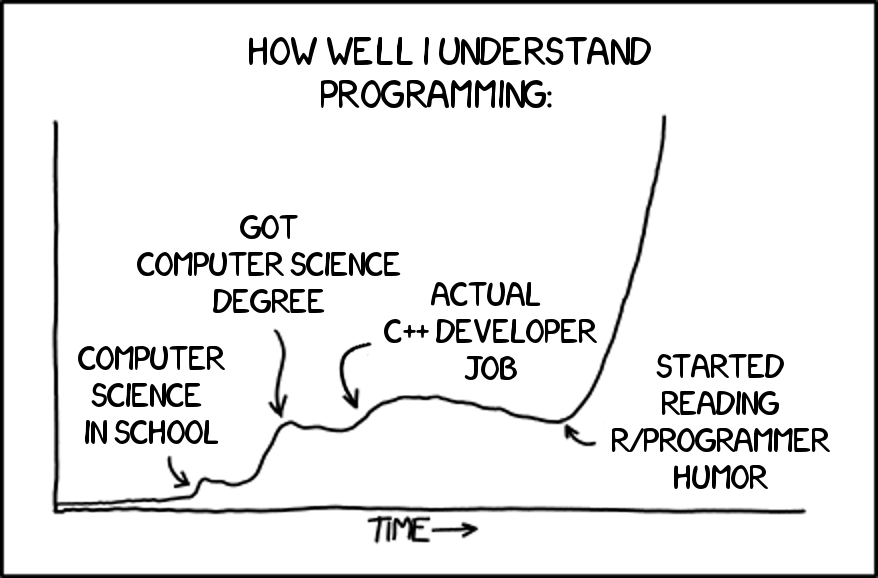
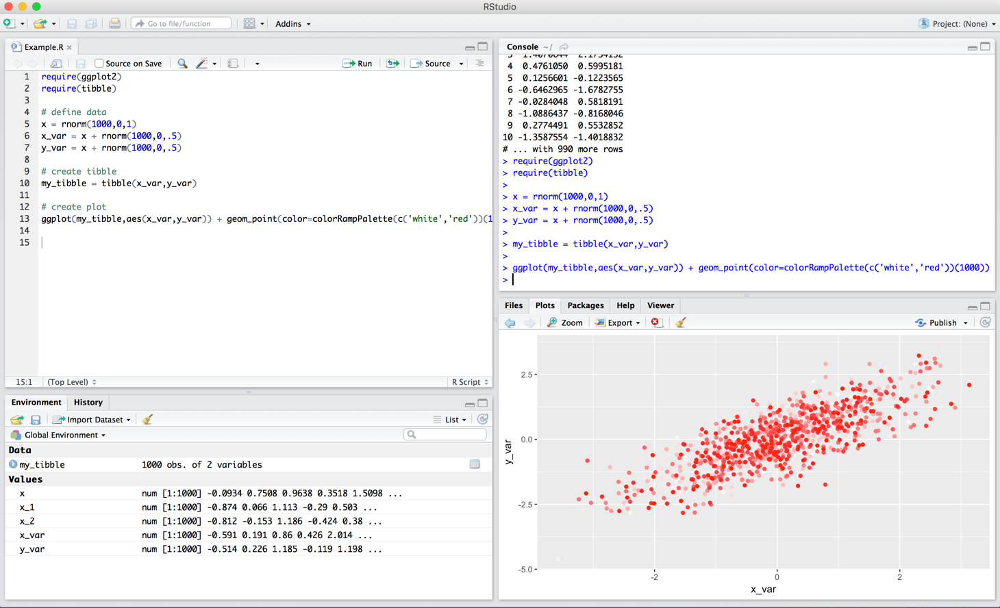

layout: true

<div class="my-footer">
  <span style="text-align:center">
    <span> 
      
    </span>
    <a href="https://therbootcamp.github.io/">
      <span style="padding-left:82px"> 
        <font color="#7E7E7E">
          www.therbootcamp.com
        </font>
      </span>
    </a>
    <a href="https://therbootcamp.github.io/">
      <font color="#7E7E7E">
      Einführung in die moderne Datenanalyse mit R | August 2021
      </font>
    </a>
    </span>
  </div> 

---

```{r setup, include=FALSE}
options(htmltools.dir.version = FALSE)
options(width=110)
options(digits = 4)

require(tidyverse)
```


# Agenda

.pull-left4[

<ul>
  <li class="m1"><span><high>R(Studio)</high><br></span></li>
  <ul class="level">
    <li><span>Was ist R?</span></li>
    <li><span>Was sind Programmiersprachen?</span></li>
    <li><span>Was ist RStudio?</span></li>
    <li><span>Warum RStudio?</span></li>
  </ul>
  </span><br>
  <li class="m2g"><span>Assignments</span></li>
  <li class="m3g"><span>Funktionen</span></li>
  <li class="m4g"><span>Data I/O</a></span></li>
  <li class="m5g"><span>Analyse</span></li>
</ul>
]

.pull-right5[

<p align = "center">
<br>
<font style="font-size:10px">from <a href="https://xkcd.com//">xkcd.com</a></font>
</p>

]

---

# Was ist R

.pull-left4[

<ul>
  <li class="m1"><span>R(Studio)<br></span></li>
  <ul class="level">
    <li><span><high>Was ist R?</high></span></li>
    <li><span>Was sind Programmiersprachen?</span></li>
    <li><span>Was ist RStudio?</span></li>
    <li><span>Warum RStudio?</span></li>
  </ul>
  </span><br>
  <li class="m2g"><span>Assignments</span></li>
  <li class="m3g"><span>Funktionen</span></li>
  <li class="m4g"><span>Data I/O</a></span></li>
  <li class="m5g"><span>Analyse</span></li>
</ul>

]

.pull-right5[

R is eine **open-source Programmiersprache** für **statistische Berechnungen und Graphiken** die von der **R Foundation for Statistical Computing** supported wird. R wird **stark von Statistkern und Datenanalysten** für die Entwicklung von statistischer Software und Datenanalyse verwendet. 

Der code der R unterliegt ist hauptsächlich in **C, Fortran, and R** geschrieben. R ist unter der GNU General Public License frei verfügbar, und es existieren Installationen für alle üblichen Systeme. Währed R für sich nur ein **command line interface** besitzt, exisistieren verschiedene **graphische Nutzerinterfaces**.

R wurde 1993 von Ross Ihaka und Robert Gentlemen auf Basis der Programmiersprache S entwickelt.  

<font style="font-size:12px">Adapted from <a href="https://en.wikipedia.org/wiki/Statistical_model">Wikipedia</a> (emphasis added)</font>

]

---

# Was ist eine Programmiersprache

.pull-left4[

<ul>
  <li class="m1"><span>R(Studio)<br></span></li>
  <ul class="level">
    <li><span>Was ist R?</span></li>
    <li><span><high>Was sind Programmiersprachen?</high></span></li>
    <li><span>Was ist RStudio?</span></li>
    <li><span>Warum RStudio?</span></li>
  </ul>
  </span><br>
  <li class="m2g"><span>Assignments</span></li>
  <li class="m3g"><span>Funktionen</span></li>
  <li class="m4g"><span>Data I/O</a></span></li>
  <li class="m5g"><span>Analyse</span></li>
</ul>

]

.pull-right5[

Eine Programmiersprache ist eine **formale Sprache** die eine Reihe Instruktionen für verschiedenste Ziele spezifiziert. Programmiersprachen bestehen aus **instruktionen für einen Computer** und werden genutzt um **Algorithmen zu implementieren**.

<u>Algorithmus in Worten</u>
1. Lade Daten
2. Extrahiere Variablen
3. Führe Analyse durch
4. Zeige Resultate

<u>Algorithmus in R</u>
<mono>data <- read.table(link)<br>
vars <- data[,c('gruppe','werte')]<br>
res <- lm(werte ~ gruppe, data = vars)<br>
summary(res)<br>
</mono>
]

---

# Was ist RStdudio

.pull-left4[

<ul>
  <li class="m1"><span>R(Studio)<br></span></li>
  <ul class="level">
    <li><span>Was ist R?</span></li>
    <li><span>Was sind Programmiersprachen?</span></li>
    <li><span><high>Was ist RStudio?</high></span></li>
    <li><span>Warum RStudio?</span></li>
  </ul>
  </span><br>
  <li class="m2g"><span>Assignments</span></li>
  <li class="m3g"><span>Funktionen</span></li>
  <li class="m4g"><span>Data I/O</a></span></li>
  <li class="m5g"><span>Analyse</span></li>
</ul>

]

.pull-right5[

<p align = "center">
  
</p>

]

---

# Warum RStudio?

.pull-left4[

<ul>
  <li class="m1"><span>R(Studio)<br></span></li>
  <ul class="level">
    <li><span>Was ist R?</span></li>
    <li><span>Was sind Programmiersprachen?</span></li>
    <li><span>Was ist RStudio?</span></li>
    <li><span><high>Warum RStudio?</high></span></li>
  </ul>
  </span><br>
  <li class="m2g"><span>Assignments</span></li>
  <li class="m3g"><span>Funktionen</span></li>
  <li class="m4g"><span>Data I/O</a></span></li>
  <li class="m5g"><span>Analyse</span></li>
</ul>

]

.pull-right5[

<p align = "left">
  
<br><br><br>
Shortcut für <high>schicke Code zur Console</high>:<br><br2><font size = 6>&#8984;/ctrl + &#9166;</font><br><br2><br2>
Shortcut für <high>führe Chunk wiederholt aus</high>:<br><br2><font size = 6>  &#8984;/ctrl + &#9095; + p</font>
</p>

]

---

# Warum RStudio?

.pull-left4[

<ul>
  <li class="m1"><span>R(Studio)<br></span></li>
  <ul class="level">
    <li><span>Was ist R?</span></li>
    <li><span>Was sind Programmiersprachen?</span></li>
    <li><span>Was ist RStudio?</span></li>
    <li><span><high>Warum RStudio?</high></span></li>
  </ul>
  </span><br>
  <li class="m2g"><span>Assignments</span></li>
  <li class="m3g"><span>Funktionen</span></li>
  <li class="m4g"><span>Data I/O</a></span></li>
  <li class="m5g"><span>Analyse</span></li>
</ul>

]

.pull-right5[

<p align = "center">
  
</p>

]


---

# Warum RStudio?

.pull-left4[

<ul>
  <li class="m1"><span>R(Studio)<br></span></li>
  <ul class="level">
    <li><span>Was ist R?</span></li>
    <li><span>Was sind Programmiersprachen?</span></li>
    <li><span>Was ist RStudio?</span></li>
    <li><span><high>Warum RStudio?</high></span></li>
  </ul>
  </span><br>
  <li class="m2g"><span>Assignments</span></li>
  <li class="m3g"><span>Funktionen</span></li>
  <li class="m4g"><span>Data I/O</a></span></li>
  <li class="m5g"><span>Analyse</span></li>
</ul>

]

.pull-right5[

<b>Projekte helfen bei...</b><br>
workspace und history speichern &#9679; projektspezifische Optionen setzen &#9679; Dateien finden &#9679; Versionskontrolle &#9679; etc.
<br><br>
<p align = "left">
  
</p>

]


---

class: middle, center

<i>Schon runtergeladen?</i>

<h1><a href="https://www.dropbox.com/s/39pwk5z0yt36urp/TheRBootcamp.zip?dl=1" download>Projekt</a></h1>

---

class: middle, center

<h1><high>Interactive</high></h1>

