layout: true

<div class="my-footer">
  <span style="text-align:center">
    <span> 
      
    </span>
    <a href="https://therbootcamp.github.io/">
      <span style="padding-left:82px"> 
        <font color="#7E7E7E">
          www.therbootcamp.com
        </font>
      </span>
    </a>
    <a href="https://therbootcamp.github.io/">
      <font color="#7E7E7E">
      Einführung in die moderne Datenanalyse mit R | August 2021
      </font>
    </a>
    </span>
  </div> 

---

```{r setup, include=FALSE}
options(htmltools.dir.version = FALSE)
options(width=110)
options(digits = 4)
library(tidyverse)
baselers <- read_csv("https://raw.githubusercontent.com/therbootcamp/baselers/master/inst/extdata/baselers.txt")
```


#  Die Datenrevolution

.pull-left4[

<i>"Fuel of the future - Data is giving rise to a new economy."</i><br>

The Economist, May 2017
<br><br>

<i>"Wie Big Data die Finanzmärkte verändern könnte"</i><br>

NZZ, August 2018
<br><br>

<i>"Machine learning will be the engine of global growth."</i><br>

Financial times, July 2018

]

.pull-right55[

<p align = "center">
  <br>
  <font style="font-size:10px">from <a href="https://www.shutterstock.com/video/clip-19206613-world-map-shining-flying-stars-particles-create">shutterstock.com</a></font>
</p>

]

---

.pull-left2[

#  Datenanalysten gesucht

]

.pull-right7[

<p align = "center">
  <br><br>
  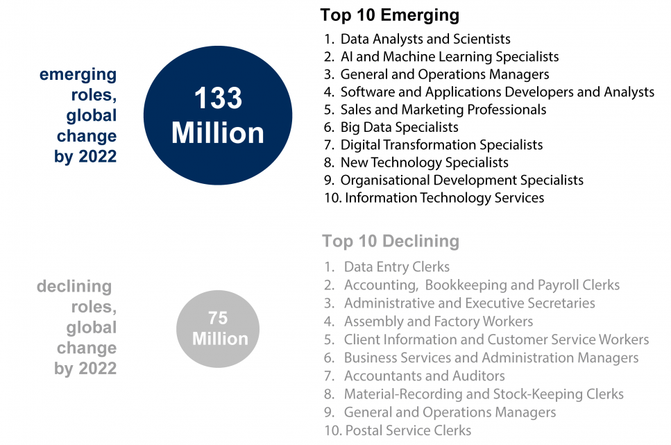<br>
  <font style="font-size:10px">adapted from <a href="https://www.weforum.org/agenda/2018/09/future-of-jobs-2018-things-to-know/">weforum.org</a></font>
</p>

]

<!---

#  Daten revolutionieren die Medizin

<p align = "center" style="padding-top:30px">
  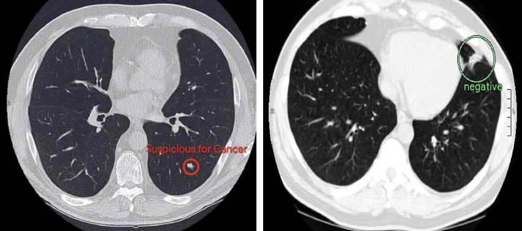<br>
  <font style="font-size:10px">from <a href="https://www.researchgate.net/publication/333228756_End-to-end_lung_cancer_screening_with_three-dimensional_deep_learning_on_low-dose_chest_computed_tomography">Ardila et al. (2019)</a></font>
</p>


#  Daten treiben Verkauf

<p align = "center" style="padding-top:30px">
  <br>
  <font style="font-size:10px">from <a href="https://venturebeat.com/2018/07/19/how-olay-used-ai-to-double-its-conversion-rate/">venturebeat.com</a></font>
</p>


#  Daten dringen in unsere Privatssphäre ein

<p align = "center" style="padding-top:30px">
  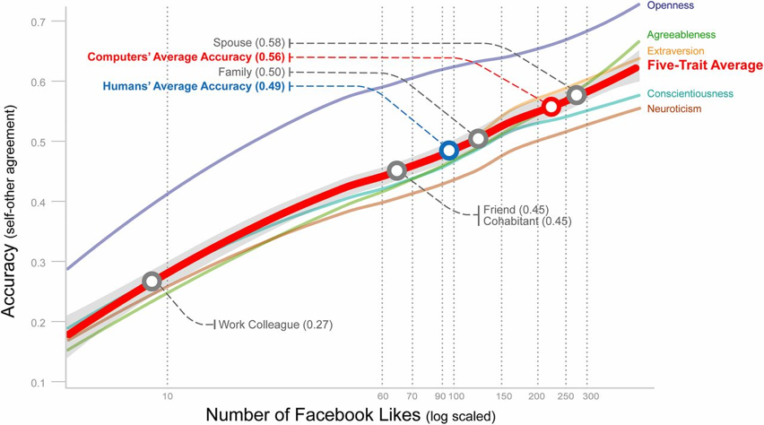<br>
  <font style="font-size:10px">from <a href="https://www.pnas.org/content/112/4/1036">Youyou, Kosinski, & Stillwell (2019)</a></font>
</p>


#  Daten haben klare Vorteile

<br>
<table class="tg"  style="cellspacing:0; cellpadding:0; border:none;">
<tr valign="top">
  <td style="padding:10px">
  <p align = "center">
  <font style="font-size:28px"><i>Präzise</i></font><br><br>
  <br>
  <font style="font-size:10px">adapted from <a href="https://stock.adobe.com/ee/search/images?k=clockwork">stock.adobe.com</a></font>
</p>
  </td>
  <td style="padding:10px">
  <p align = "center">
  <font style="font-size:28px"><i>Reproduzierbar</i></font><br><br>
  <br>
  <font style="font-size:10px">adapted from <a href="https://www.dreamstime.com/beer-filling-brewery-conveyor-belt-glass-bottles-machine-image106996530">dreamstime.com</a></font>
</p>
  </td>
  <td style="padding:10px">
  <p align = "center">
  <font style="font-size:28px"><i>Objektiv</i></font><br><br>
  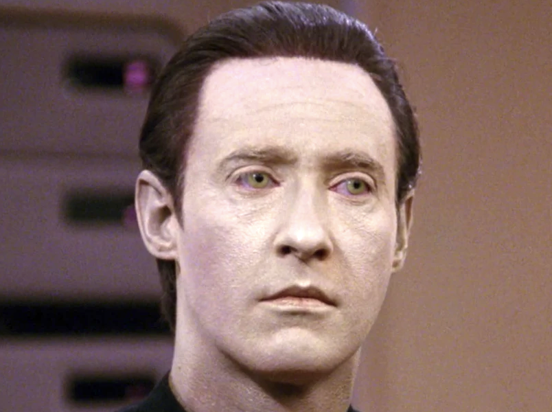<br>
  <font style="font-size:10px">adapted from <a href="https://memory-alpha.fandom.com/wiki/Data">memory-alpha.fandom.com</a></font>
</p>
  </td>
</tr>
</table>


--->

---

# Die 3 Säulen der Datenrevolution

<table class="tg"  style="cellspacing:0; cellpadding:0; border:none;">
<tr valign="top">
  <td style="padding:10px">
  <p align = "center">
  <font style="font-size:28px"><i>Data</i></font><br><br>
  <br>
  <font style="font-size:10px">adapted from <a href="https://www.rathenau.nl/en/digital-society/data-driven-cities">rathenau.nl</a></font>
</p>
  </td>
  <td style="padding:10px">
  <p align = "center">
  <font style="font-size:28px"><i>Computing</i></font><br><br>
  <br>
  <font style="font-size:10px">adapted from <a href="https://cei.org/file/internet-server-farm">cei.org</a></font>
</p>
  </td>
  <td style="padding:10px">
  <p align = "center">
  <font style="font-size:28px"><i>Tools</i></font><br><br>
  <br>
  <font style="font-size:10px">adapted from <a href="https://www.ionos.de/digitalguide/websites/web-entwicklung/code-editoren/">ionos.de</a></font>
</p>
  </td>
</tr>
</table>

<!---

.pull-left3[

# Die Datenmenge wächst rasant

]

.pull-right65[
<br><br><br>
<p align = "center">
  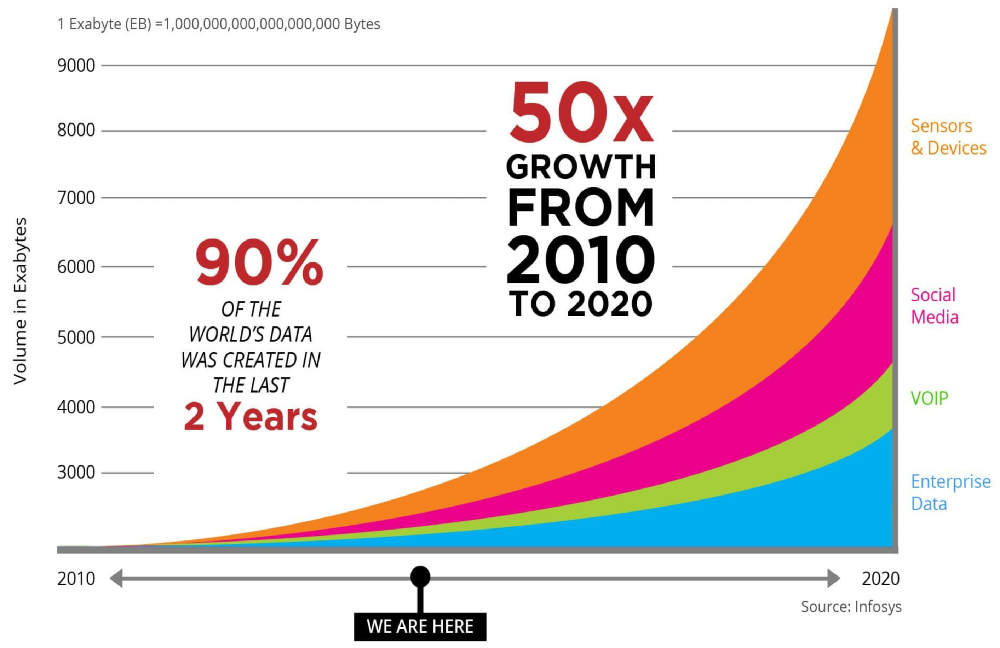<br>
  <font style="font-size:10px">from <a href="https://blog.siib.ac.in/changing-world-development-of-artificial-intelligence/">blog.siib.ac.in</a></font>
</p>

]

# Computing wird rasant schneller und billiger 

<table class="tg"  style="cellspacing:0; cellpadding:0; border:none;">
<tr valign="top">
  <td style="padding-bottom:60px;padding-right:50px;vertical-align:bottom">
  <p align = "center">
  <br>
  <font style="font-size:10px">Ray Kurzweil, adapted from <a href="https://www.wsj.com/articles/ray-kurzweil-looks-into-the-future-1401490952">wsj.com</a></font>
</p>
  </td>
  <td style="padding-bottom:60px;padding-left:50px;vertical-align:bottom">
  <p align = "center">
  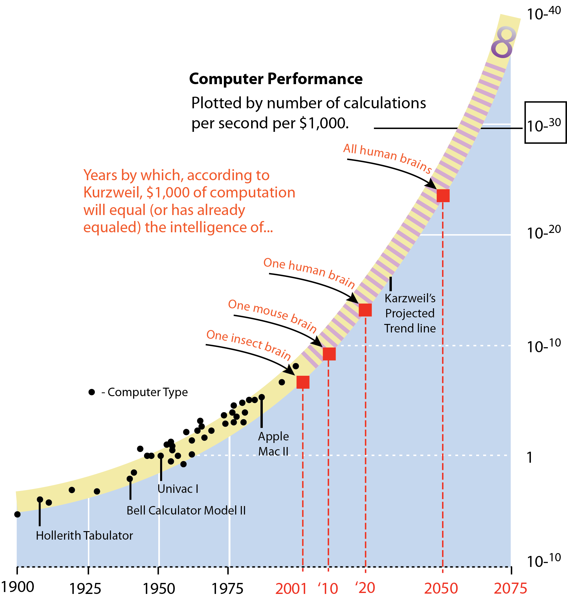<br>
  <font style="font-size:10px">from <a href="http://www.americanprof.net/apn-ai/index.php/tool-box/ray-kurzweil">americanprof.net</a></font>
</p>
</td>
</tr>
</table>

--->

---

# Immer mehr (gute) tools


<p align = "center">
  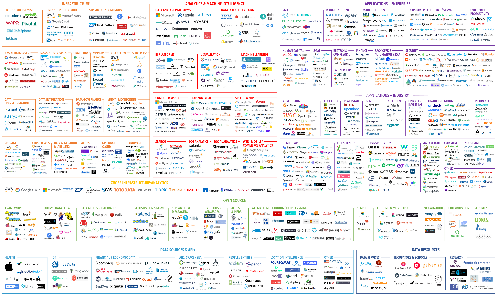<br>
  <font style="font-size:10px">adapted from <a href="https://mattturck.com/data2019/">mattturck.com</a></font>
</p>


---

# Point-and-click tools
<br>
<table style="cellspacing:0; cellpadding:0; border:none; width:70%">
  <col width="20%">
  <col width="20%">
  <col width="20%">
  <tr style="padding:20px;background-color:white">
  <td style="padding:20px;text-align:center">
    
  </td>
  <td style="padding:20px;text-align:center">
    
  </td>
  <td style="padding:20px;text-align:center">
    
  </td>
  </tr>
<tr style="padding:20px;background-color:white">
  <td style="padding:20px;text-align:center">
  
  <td style="padding:20px;text-align:center">

  </td>
  <td style="padding:20px;text-align:center">

  </td>


  </tr>
</table>


---

.pull-left3[

# Der Data Science Prozess

]

.pull-right7[
<br><br>
<p align = "center">
  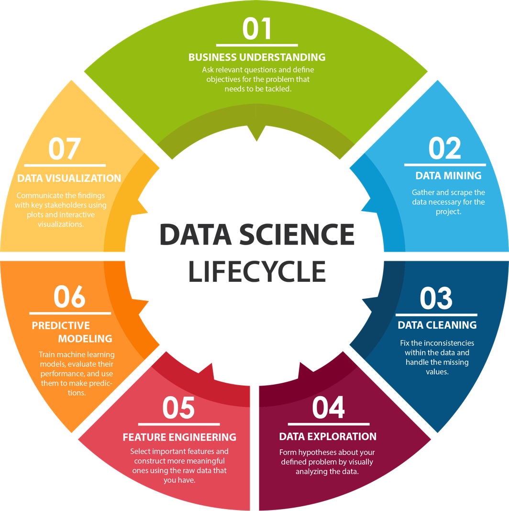<br>
  <font style="font-size:10px">from <a href="https://www.bytelion.com/services/datascience/">bytelion.com</a></font>
</p>

]


---

# Syntaxbasierte tools

<br><br>
<p align = "center">
  <br>
  <font style="font-size:10px">from <a href="https://www.sharpsightlabs.com/blog/r-vs-python/">sharpsightlabs.com</a></font>

---

# Nachfrage

.pull-left45[

<p align = "center">
  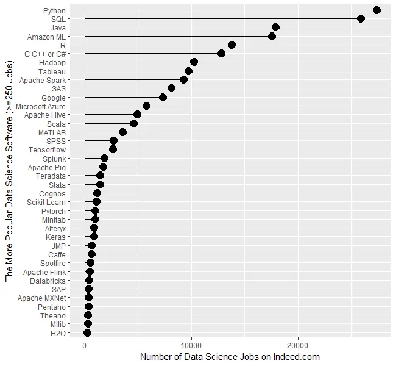<br>
  <font style="font-size:10px">from <a href="http://r4stats.com/articles/popularity/">r4stats.com</a></font>
</p>

]

.pull-right45[
<p align = "center">
  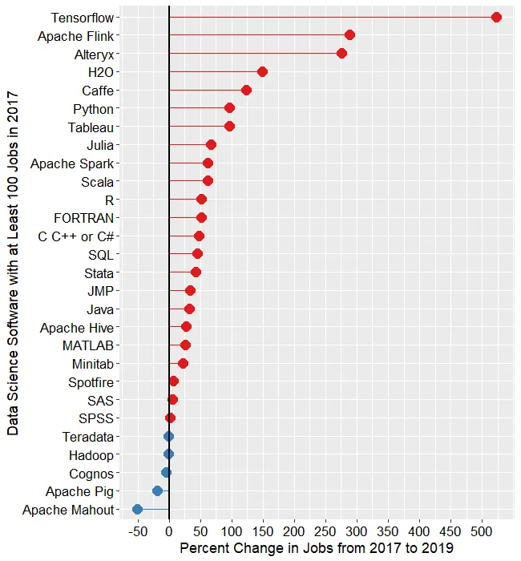<br>
  <font style="font-size:10px">from <a href="http://r4stats.com/articles/popularity/">r4stats.com</a></font>
</p>

]


<!---

# Charakterzüge <font style="font-size:16px">siehe auch diese <a href="image/rversuspython.jpeg">Infographik</a>

<br><br>
<table style="cellspacing:0; cellpadding:0; border:none; width:90%">
  <col width="35%">
<tr style="padding:20px;background-color:white">
  <td>
  </td>
  <td style="padding:10px;text-align:center">
  <font style="font-size:20px"><b>Benutzt von</b></font>
  </td>
  </td>
  <td style="padding:10px;text-align: center">
  <font style="font-size:20px"><b>Entwickelt für</b></font>
  </td>
  <td style="padding:10px;text-align: center">
  <font style="font-size:20px"><b>Besser in</b></font>
  </td>
  <td style="padding:10px;text-align: center">
  <font style="font-size:20px"><b>Umgebung</b></font>
  </td>
  <td style="padding:10px;text-align: center">
  <font style="font-size:20px"><b>Für wen?</b></font>
  </td>
  </tr>
<tr style="padding:20px;background-color:white">
  <td style="padding:10px;text-align: left">
  
  </td>
  <td style="padding:10px;text-align: center">
  Wissenschaftlern, Statistikern und Analysten
  </td>
  <td style="padding:10px;text-align: center">
  Datenanalyse
  </td>
  <td style="padding:10px;text-align: center">
  Produktivität und Reporting
  </td>
  <td style="padding:10px;text-align: center">
  RStudio
  </td>
  <td style="padding:10px;text-align: center">
  Programmier Einsteiger
  </td>
  </tr>
<tr style="padding:20px;background-color:white">
  <td style="padding:10px;text-align: left"">
  
  </td>
  <td style="padding:10px;text-align: center">
  Softwareentwickler und Programmierer
  </td>
  <td style="padding:10px;text-align: center">
  Systemprogrammierung
  </td>
  <td style="padding:10px;text-align: center">
  Einbettung in Systeme und Apps 
  </td>
  <td style="padding:10px;text-align: center">
  Jupyter Notebooks
  </td>
  <td style="padding:10px;text-align: center">
  Erfahrene Programmierer
  </td>
  </tr>
</table>


# R bleibt relevant


.pull-left45[
### Pro
<ul>
  <li class="m1"><span><high>Open-source</high> = umsonst</span></li>
  <li class="m2"><span><high>Community</high> (e.g., <a href="https://stackoverflow.com/">stackoverflow</a>)</span></li>
  <li class="m3"><span><high>Erweiterbarkeit</high> (<a href="https://cran.r-project.org/">CRAN</a>)</span></li>
  <li class="m4"><span><a href="https://www.tidyverse.org/"><high>Tidyverse</high></a></span></li>
  <li class="m5"><span><a href="https://www.rstudio.com/"><high>RStudio</high></a></span></li>
  <li class="m6"><span><high>Produktivitätsoptionen</high>: <a href="(https://www.latex-project.org/">Latex</a>), <a href="https://daringfireball.net/projects/markdown/">Markdown</a>, <a href="https://github.com/">GitHub</a></span></li>
</ul>
]


.pull-right45[
### (Ehemals) Contra
<ul>
  <li class="m1"><span><high>Unschön</high>e Sprache wird überarbeitet <a href="https://www.tidyverse.org/">Tidyverse</a></span></li>
  <li class="m2"><span><high><high>Langsam</high>e Elemente werden ersetzt (<a href="http://www.rcpp.org/">Rcpp</a>)</span></li>
  <li class="m3"><span><high>Brücken</high> zu externen Tools/Sprachen (e.g., <a href="http://rpython.r-forge.r-project.org/">rPython</a>, <a href="https://tensorflow.rstudio.com/">tensorflow</a></span></li>
</ul>

]

--->

---

# R bleibt relevant
<br>
<table class="tg"  style="cellspacing:0; cellpadding:0; border:none;" width="95%">
<col width="25%">
<col width="35%">
<col width="25%">
<tr valign="top">
  <td style="padding:20px">
  <p align = "center">
  <font style="font-size:28px"><i>R</i></font><br><br>
  <br>
  <font style="font-size:10px">adapted from <a href="https://cei.org/file/internet-server-farm">cei.org</a></font>
  </p>
  </td>
  <td style="padding:20px">
  <p align = "center">
  <font style="font-size:28px"><i>RStudio</i></font><br><br>
  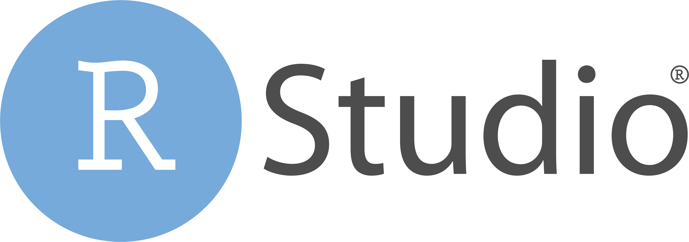<br>
  <font style="font-size:10px">adapted from <a href="https://rstudio.com/">rstudio.com</a></font>
</p>
  </td>
  <td style="padding:20px">
  <p align = "center">
  <font style="font-size:28px"><i>R Packages</i></font><br><br>
  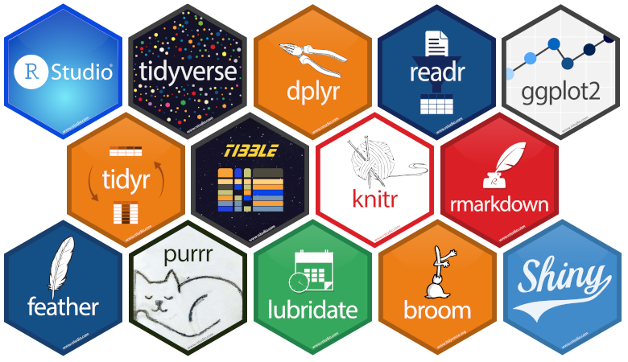<br>
  <font style="font-size:10px">adapted from <a href="https://towardsdatascience.com/ten-random-useful-things-in-r-that-you-might-not-know-about-54b2044a3868">towardsdatascience.com</a></font>
</p>
  </td>
</tr>
</table>

---
class: middle, center

<h1><a href=https://therbootcamp.github.io/I2R_2020Aug/index.html>Schedule</a></h1>
