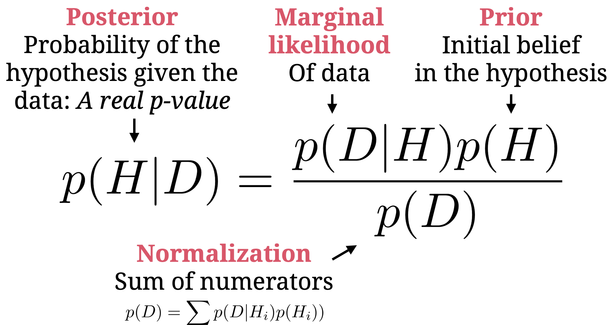
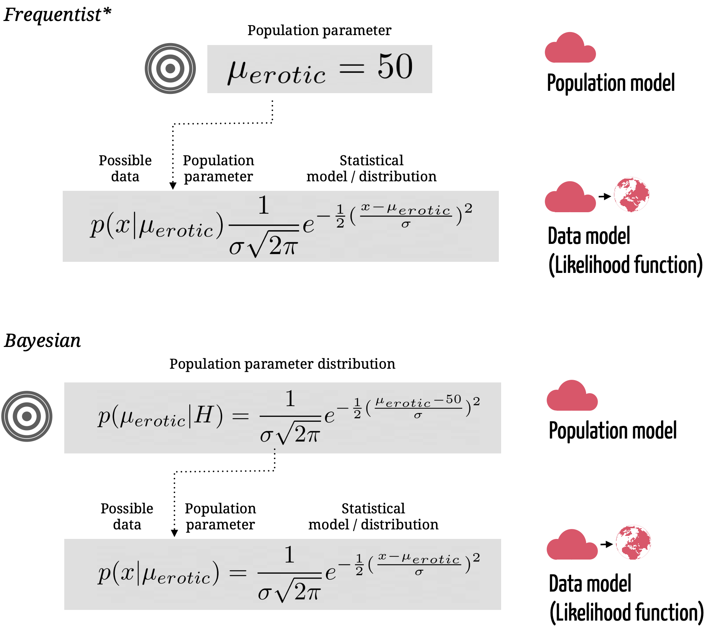
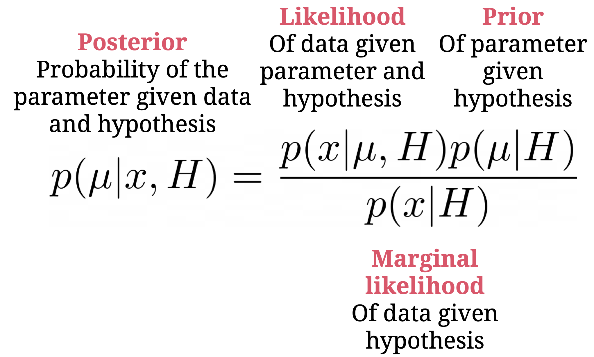
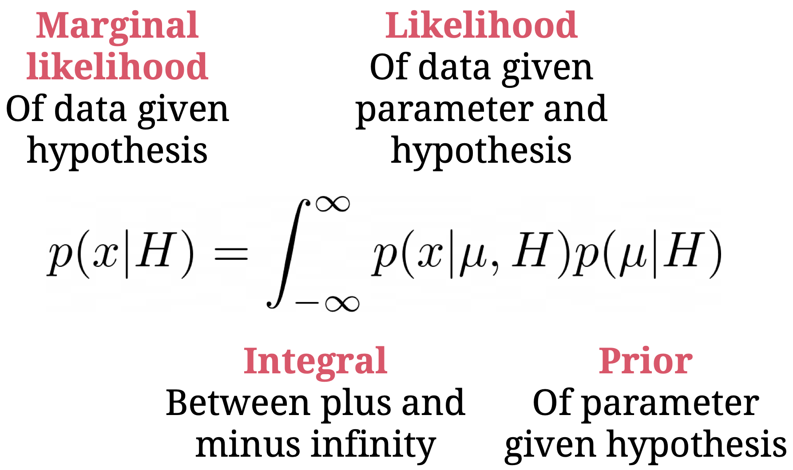
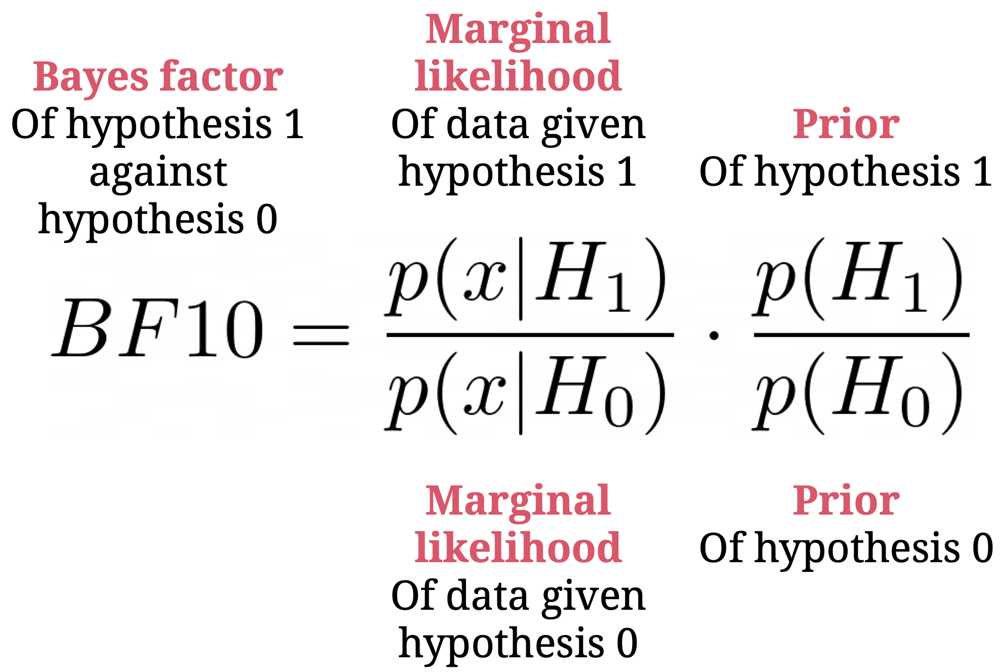
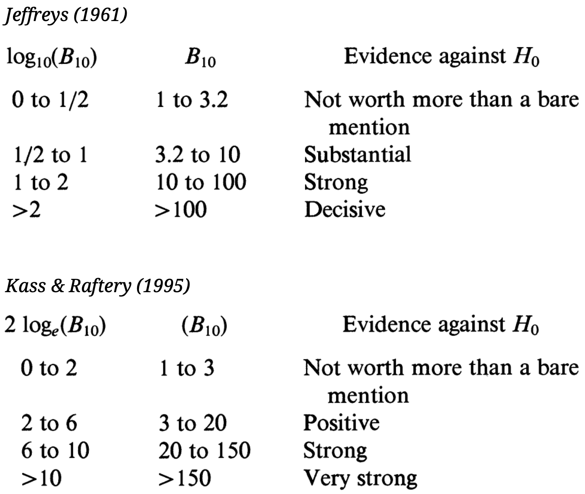

layout: true

<div class="my-footer">
  <span style="text-align:center">
    <span> 
      
    </span>
    <a href="https://www.dirkwulff.org/">
      <span style="padding-left:82px"> 
        <font color="#7E7E7E">
          dirkwulff.org
        </font>
      </span>
    </a>
    <a href="https://therbootcamp.github.io/">
      <font color="#7E7E7E">
      New Statistics | September 2021
      </font>
    </a>
    </span>
  </div> 

---


```{r, eval = TRUE, echo = FALSE, warning=F,message=F}
# Code to knit slides

```

```{r setup, include=FALSE}
options(htmltools.dir.version = FALSE)
options(width = 110)
options(digits = 4)

# Load packages
require(tidyverse)
require(BayesFactor)
require(rstanarm)
require(bayestestR)

psi = read_csv("1_data/psi_exp_1.csv")

print2 <- function(x, nlines=10,...) {
   cat(head(capture.output(print(x,...)), nlines), sep="\n")}
```


.pull-left35[

# Bayesian statistics

<ul>
  <li class="m1"><span>Introduces <high>priors</high> so that potseriors can be derived from <high>Bayes theorem</high>.</span></li>
  <li class="m2"><span>Advantages</span></li>
  <ul class="level">
    <li><span>Key statistics of interest</span></li>
    <li><span>Making prior assumptions explicit</span></li>
    <li><span>Characterization of uncertainty</span></li>
    <li><span>Facilitates estimation</span></li>
    <li><span>Naturally accounts for model complexity</span></li>
  </ul>
    
</ul>


]

.pull-right55[

<br><br><br><br>
<p align = "center" style="padding-top:20px">
<br>
</p>

]

---

.pull-left35[

# Bayesian statistics

<ul>
  <li class="m1"><span>Introduces <high>priors</high> so that potseriors can be derived from <high>Bayes theorem</high>.</span></li>  
  <li class="m2"><span>Advantages</span></li>
  <ul class="level">
    <li><span>Key statistics of interest</span></li>
    <li><span>Making prior assumptions explicit</span></li>
    <li><span>Characterization of uncertainty</span></li>
    <li><span>Facilitates estimation</span></li>
    <li><span>Naturally accounts for model complexity</span></li>
  </ul>
    
</ul>


]

.pull-right55[

<br>
<p align = "center">
<br>
<font style="font-size:10px">from <a = href="https://xkcd.com/1132/">xkcd.com</a></font>
</p>

]


---

.pull-left3[

# Parameter priors

<ul>
  <li class="m1"><span>Hypotheses in Bayesian statistics are usually sets of hypotheses, which are described by a prior distribution.</span></li>  
  <li class="m2"><span>The prior distribution on parameters is what enables us to characterize the uncertainty in our effect estimation.</span></li>  
</ul>

]

.pull-right6[

<p align = "left" >
  
</p>

]

---


# Parameter posteriors

.pull-left35[

<ul>
  <li class="m1"><span>Bayes theorem can be employed to derive posterior distributions for each parameter.</span></li>  
  <li class="m2"><span>The posterior distribution of parameters is what enables us to characterize the uncertainty in our effect estimation.</span></li>  
</ul>

]

.pull-right5[

<p align = "left" >
  
</p>

]

---

# Example t-test

.pull-left35[

<ul>
  <li class="m1"><span>In Bayesian analyses the t-test is often parameterized in terms of Cohen's <i>d</i>.</span></li>  
  <li class="m2"><span>The prior on Cohen's <i>d</i> is in those cases a <a href="https://en.wikipedia.org/wiki/Cauchy_distribution">Cauchy distribution</a>.</span></li>  
</ul>

]

.pull-right5[

```{r, fig.asp=.8, echo = F, dpi=300}

par(mar=c(4, 4, .2, 1))

x = seq(-4, 4, .01)
y = dcauchy(x, scale = sqrt(2)/2)
plot(x, y, type = "l", xlab = expression(italic(d)), lwd=4, 
     ylab = "Density", ylim=c(0,4), xlim=c(-1.5, 1.5), cex.lab=1.2)

set.seed(100)
test = ttestBF(psi$erotic, mu = 50)
chains = posterior(ttestBF(psi$erotic, mu = 50), iterations = 1000)
d_post = (chains[,"mu"]-50) / sqrt(chains[,"sig2"])
d_post_dens = density(d_post, from = -4, to = 4, n=801)
lines(d_post_dens$x, d_post_dens$y * (sum(y)/sum(d_post_dens$y)), lwd=4, col='#EA4B68')
text(x = .6, y = 2.5, labels = "Posterior", cex=1.2, col='#EA4B68')
text(x = -1, y = .4, labels = "Prior", cex=1.2)

```


]


---

# Evaluating the posterior

.pull-left35[

<ul>
  <li class="m1"><span>Shows us how believable the possible values of a parameter are, after the data has been observed.</span></li>  
  <li class="m2"><span>Difference proposals exist to evaluate the distribtion.</span></li>  
  <ul class="level">
    <li><span><high>Bayesian maximum a posteriori p-value</high></span></li>  
    <li><span>Highest density / credibility interval</span></li>  
  </ul>
</ul>

]

.pull-right5[

```{r, fig.asp=.8, echo = F, dpi=300}

par(mar=c(4, 4, .2, 1))

x = seq(-4, 4, .01)
y = dcauchy(x, scale = sqrt(2)/2)
plot(x, y, type = "l", xlab = expression(italic(d)), lwd=4, 
     ylab = "Density", ylim=c(0,4), xlim=c(-1.5, 1.5), cex.lab=1.2)

set.seed(100)
test = ttestBF(psi$erotic, mu = 50)
chains = posterior(ttestBF(psi$erotic, mu = 50), iterations = 1000)
d_post = (chains[,"mu"]-50) / sqrt(chains[,"sig2"])
d_post_dens = density(d_post, from = -4, to = 4, n=801)
d_post_dens$y = d_post_dens$y * (sum(y)/sum(d_post_dens$y))

lines(rep(0, 2), c(0, y[which(x == 0)]), lwd=2, lty=2)
points(0, y[which(x == 0)], pch = 16, cex=1)

lines(d_post_dens$x, d_post_dens$y , lwd=4, col='#EA4B68')
text(x = .6, y = 2.5, labels = "Posterior", cex=1.2, col='#EA4B68')
text(x = -1, y = .4, labels = "Prior", cex=1.2)

sel = which.max(d_post_dens$y)
lines(rep(d_post_dens$x[sel], 2), c(0, d_post_dens$y[sel]), lwd=2, lty=2)
points(d_post_dens$x[sel], d_post_dens$y[sel], pch = 16, cex=1)


```


]


---

# Evaluating the posterior

.pull-left35[

<ul>
  <li class="m1"><span>Shows us how believable the possible values of a parameter are, after the data has been observed.</span></li>  
  <li class="m2"><span>Difference proposals exist to evaluate the distribtion.</span></li>  
  <ul class="level">
    <li><span>Bayesian maximum a posteriori p-value.</span></li>  
    <li><span><high>Highest density / credibility interval</high>.</span></li>  
  </ul>
</ul>

]

.pull-right5[

```{r, fig.asp=.8, echo = F, dpi=300}

par(mar=c(4, 4, .2, 1))

x = seq(-4, 4, .01)
y = dcauchy(x, scale = sqrt(2)/2)
plot(x, y, type = "n", xlab = expression(italic(d)), lwd=2, 
     ylab = "Density", ylim=c(0,4), xlim=c(-1.5, 1.5), cex.lab=1.2, lty=2)

lines(c(0,0),c(0,4), lty=2, lwd=2)

set.seed(100)
test = ttestBF(psi$erotic, mu = 50)
chains = posterior(ttestBF(psi$erotic, mu = 50), iterations = 1000)
d_post = (chains[,"mu"]-50) / sqrt(chains[,"sig2"])
d_post_dens = density(d_post, from = -4, to = 4, n=801)
d_post_dens$y = d_post_dens$y * (sum(y)/sum(d_post_dens$y))

lines(d_post_dens$x, d_post_dens$y , lwd=4, col='#EA4B68')
text(x = .6, y = 2.5, labels = "Posterior", cex=1.2, col='#EA4B68')
text(x = -1, y = .4, labels = "Prior", cex=1.2)

hdi = hdi(d_post)

lines(d_post_dens$x, d_post_dens$y , lwd=4)

x = d_post_dens$x
y = d_post_dens$y
sel = which(x > hdi$CI_low & x < hdi$CI_high)
polygon(c(x[sel[1]], x[sel], x[sel[length(sel)]]), c(0, y[sel], 0), border=NA, col='#EA4B68')

lines(x[sel], y[sel], lwd=4, col='#EA4B68')

  
text(x = (hdi$CI_low + hdi$CI_high)/2, y = 1, labels = "95% HDI", cex=1, col='white')
#text(x = -1, y = .4, labels = "Prior", cex=1.2)

text(x = .6, y = 2.5, labels = "Posterior", cex=1.2)

  
```

]


---

# Sampling

.pull-left4[


<ul>
  <li class="m1"><span>In most cases, the posterior distribution cannot be calculated, but must be sampled instead.</span></li>  
  <li class="m2"><span>One way to sample would be to draw values from the prior, but that would be very inefficient.</span></li>  
  <li class="m3"><span>There exist many more efficient algorithms, such as Metropolis Hastings or Gibbs algorithms.</span></li>  
</ul>

<p align = "center" >
  
</p>

]

.pull-right5[

```{r, echo = F, fig.asp=.9}

set.seed(100)
test = ttestBF(psi$erotic, mu = 50)
chains = posterior(ttestBF(psi$erotic, mu = 50), iterations = 1000)
d_post = (chains[,"mu"]-50) / sqrt(chains[,"sig2"])

layout(matrix(1:2, nrow=2), height=c(.1, .2))
par(mar=c(1, 4.2, .1, 1))
plot(density(d_post[1:500]), xlim=c(-.1, .5), col='#EA4B68', type = 'l', xaxt="n", main = "", lwd=4,
     cex.lab = 1.2)
par(mar=c(4, 4.2, .1, 1))
plot(x = d_post[1:500], y = 1:500, type = 'l', col='#EA4B68', lwd=2, xlim=c(-.1, .5), 
     ylab = "Iteration", xlab = expression(italic(d)), cex.lab = 1.2)


```


]


---

# Marginal likelihood


.pull-left4[

<ul>
  <li class="m1"><span>The likelihood of the data not in light of a single parameter values (as in, e.g., maximum likelihood) but <high>in light of the full prior</high>.</span></li>  
  <li class="m2"><span>Automatically accounts for the precision of the prior and, thus, model complexity.</span></li> 
  <li class="m3"><span>Must typically be sampled.</span></li> 
</ul>

]

.pull-right5[

<p align = "center" >
  
</p>

]


---

# Bayes factor


.pull-left4[

<ul>
  <li class="m1"><span>Generalization of the likelihood ratio.</span></li>  
  <li class="m2"><span>Quantifies evidence in favor of considered hypotheses.</span></li> 
  <li class="m3"><span>Can show evidence for the NULL.</span></li> 
  <li class="m4"><span>BF<sub>01</sub> = 1/BF<sub>10</sub>.</span></li> 
</ul>

]

.pull-right5[

<p align = "center" >
  
</p>

]

---

# Evaluating Bayes factors


.pull-left4[

<ul>
  <li class="m1"><span>Several systems for evaluating Bayes factors.</span></li> 
  <li class="m2"><span>Obviously all are arbitrary to an extend.</span></li> 

</ul>

]

.pull-right5[

<p align = "center" >
  <br>
  <font style="font-size:12px">from Kass & Raftery (1994)</font>
</p>

]

---

# Bayesian statistics in R

.pull-left45[

<ul>
  <li class="m1"><span>There are several great R packages that <high>make Bayesian statistics easy</high>.</span></li>
</ul>

<br>

<table align="center" style="cellspacing:0; cellpadding:0; border:none; padding-bottom:30px">
  <col width="25%">
  <col width="50%">
  <col width="25%">
<tr>
  <td bgcolor="white">
    <b>Package</b>
  </td>  
  <td bgcolor="white">
    <b>Description</b>
  </td>
  <td bgcolor="white">
    <b>Tutorial</b>
  </td>
</tr>
<tr>
  <td bgcolor="white">
    <mono>BayesFactor</mono>
  </td>
  <td bgcolor="white">
    Standard statistical models; has focus on model comparison
  </td>
  <td bgcolor="white">
  <a href="https://cran.r-project.org/web/packages/BayesFactor/vignettes/manual.html">vignettes</a>
  </td>
</tr>
<tr>
  <td bgcolor="white">
    <mono>rstanarm</mono>
  </td>
  <td bgcolor="white">
    Most statistical models fitted via <a href="https://mc-stan.org/">stan</a>
  </td>
  <td bgcolor="white">
  <a href="https://mc-stan.org/rstanarm/">vignettes</a>
  </td>
</tr>
<tr>
  <td bgcolor="white">
    <mono>brms</mono>
  </td>
  <td bgcolor="white">
    Most statistical models via <a href="https://mc-stan.org/">stan</a>
  </td>
  <td bgcolor="white">
  <a href="https://mc-stan.org/rstanarm/">vignettes</a>
  </td>
</tr>
</table>

]

.pull-right45[

<p align = "center">
<br><br>
</img>
</p>

]

---

# Bayes factor

.pull-left45[

<ul>
  <li class="m1"><span>The `BayesFactor` package is great for Bayes factor analyses of standard statistical hypothesis test.</span></li>
</ul>

<br>

```{r, eval = F}
# load BayesFactor
library(BayesFactor)

# run one-sample t-test 
psi_test <- ttestBf(x = psi$erotic, 
                    mu = 50)

#print results
psi_test
```

]

.pull-right45[

```{r, include = FALSE}

library(BayesFactor)

psi_test = ttestBF(x = psi$erotic,
        mu = 50)
```

```{r, echo = F}
options(width = 45)
print2(psi_test, 21)
```

]

---

# Posterior

.pull-left45[

<ul>
  <li class="m1"><span>The package relies on efficient shortcuts to the Bayes factor, that do not involve traditional samples from the posterior.</span></li>
</ul>

<br>

```{r, eval = F}
# load BayesFactor
library(BayesFactor)

# run one-sample t-test 
psi_test <- ttestBF(x = psi$erotic, 
                    mu = 50)

#extract chains
chains <- posterior(psi_test, 
                    iterations = 1000)
```

]

.pull-right45[

```{r, include = FALSE}
# load BayesFactor
library(BayesFactor)

# run one-sample t-test 
psi_test <- ttestBF(x = psi$erotic, 
                    mu = 50)

#extract chains
chains <- posterior(psi_test, iterations = 1000)
```

```{r, echo = F}
options(width = 45)
chains[1:20,]
```

]

---

# Posterior

.pull-left45[

<ul>
  <li class="m1"><span>The package relies on efficient shortcuts to the Bayes factor, that do not involve traditional samples from the poster.</span></li>
</ul>

<br>

```{r, eval = F}
# load BayesFactor
library(BayesFactor)

# run one-sample t-test 
psi_test <- ttestBF(x = psi$erotic, 
                    mu = 50)

#extract chains
chains <- posterior(psi_test, 
                    iterations = 1000)

# visualize
plot(chains[,c("mu", "sig2")])
```

]

.pull-right45[

```{r, include = FALSE}
# load BayesFactor
library(BayesFactor)

# run one-sample t-test 
psi_test <- ttestBF(x = psi$erotic, 
                    mu = 50)

#extract chains
chains <- posterior(psi_test, iterations = 1000)

```

```{r, echo = F}
options(width = 45)
plot(chains[,c("mu", "sig2")])
```

]


---

# Posterior HDI

.pull-left45[

<ul>
  <li class="m1"><span>The `bayestestR` package helps with analyzing posterior distributions.</span></li>
</ul>

<br>

```{r, eval = F}
# load BayesFactor
library(BayesFactor)
library(bayestestR)

# run one-sample t-test 
psi_test <- ttestBF(x = psi$erotic, 
                    mu = 50)

#extract chains
chains <- posterior(psi_test, 
                    iterations = 1000)

# hdi of mu
hdi(chains[,c("mu")])
```

]

.pull-right45[

```{r, include = FALSE}
# load BayesFactor
library(BayesFactor)
library(bayestestR)

# run one-sample t-test 
psi_test <- ttestBF(x = psi$erotic, 
                    mu = 50)

#extract chains
chains <- posterior(psi_test, iterations = 1000)

hdi = hdi(chains[,c("mu")])

```

```{r, echo = F, fig.asp=.6}
options(width = 45)
# hdi of mu


plot(density(chains[,c("mu")]), main=expression(paste("HDI of ", mu)), xlab = expression(mu), cex.lab = 1.2)
x = density(chains[,c("mu")])$x
y = density(chains[,c("mu")])$y
sel = which(x > hdi$CI_low & x < hdi$CI_high)
polygon(c(x[sel[1]], x[sel], x[sel[length(sel)]]), c(0, y[sel], 0), border=NA, col='#EA4B68')
mtext(expression(H[0]), side=1, at = 50, line=2, cex=.7)

hdi(chains[,c("mu")])
```

]


---

.pull-left45[

# Regression

<ul>
  <li class="m1"><span>Rival packages focusing on parameter estimation rather than model comparisons are `rstanarm` and `brms`.</span></li>
</ul>

<br>

```{r, eval = F}
# load rstanarm
library(rstanarm)

# run multiple regression
bayes_reg <- stan_glm(
  formula = erotic ~ gender + stimulus_seeking, 
  data = psi)

# show summary
summary(bayes_reg)
```

]

.pull-right45[

<br>

```{r, include = FALSE, message = F}
# load rstanarm
library(rstanarm)

# run multiple regression
bayes_reg <- stan_glm(
  formula = erotic ~ gender + 
                     stimulus_seeking, 
  data = psi)

```

```{r, echo = F, fig.asp=.6, message = F}
# show summary
print2(summary(bayes_reg), 26)
```

]


---

class: middle, center

<h1><a href="https://dwulff.github.io/newstats/_sessions/bayesian_statistics/bayesian_staistics_practical.html">Practical</a></h1>

