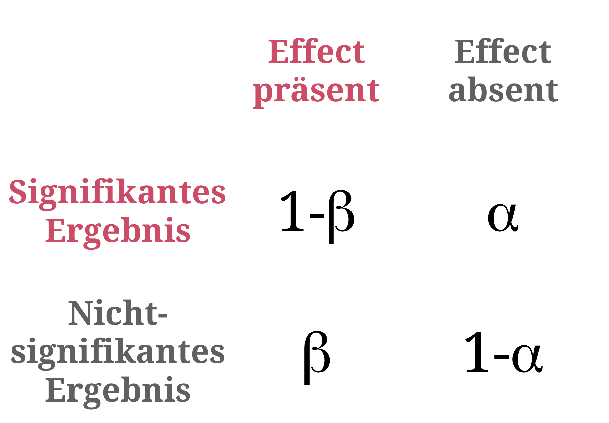
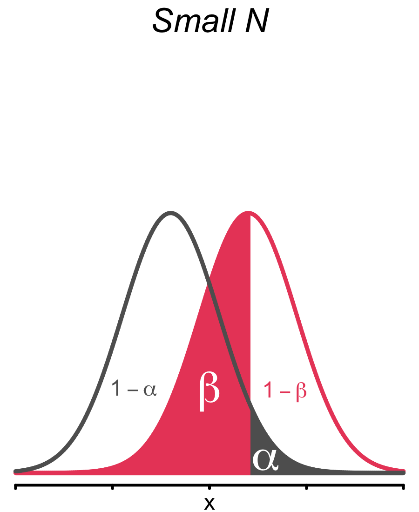
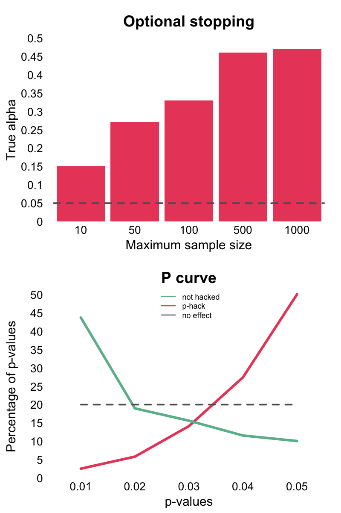
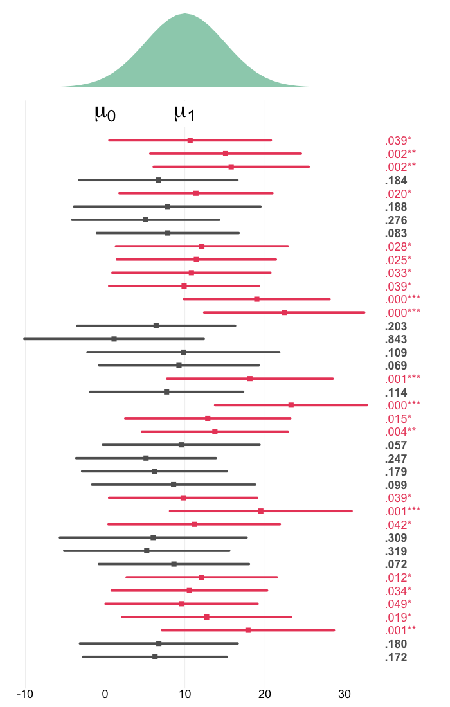
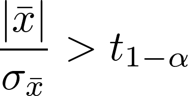
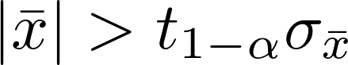
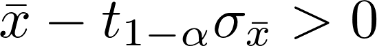
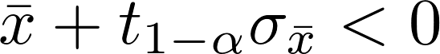
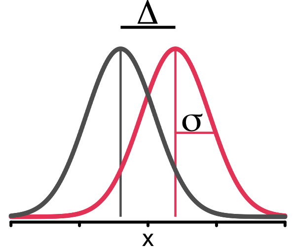
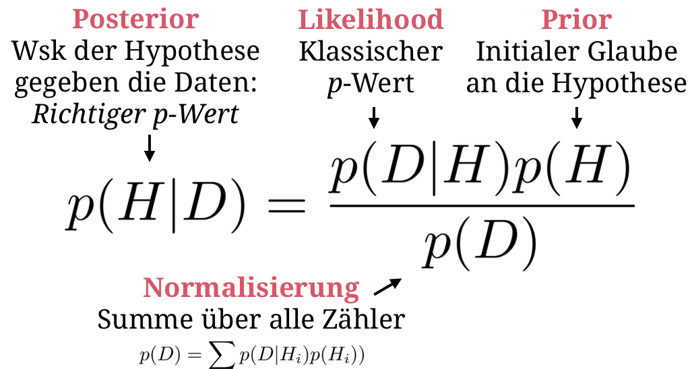

layout: true

<div class="my-footer">
  <span style="text-align:center">
    <span> 
      
    </span>
    <a href="https://www.dirkwulff.org/">
      <span style="padding-left:82px"> 
        <font color="#7E7E7E">
          dirkwulff.org
        </font>
      </span>
    </a>
    <a href="https://therbootcamp.github.io/">
      <font color="#7E7E7E">
      New Statistics | September 2021
      </font>
    </a>
    </span>
  </div> 

---


```{r, eval = TRUE, echo = FALSE, warning=F,message=F}
# Code to knit slides

```

```{r setup, include=FALSE}
options(htmltools.dir.version = FALSE)
options(width = 110)
options(digits = 4)

# Load packages
require(tidyverse)
require(boot)

print2 <- function(x, nlines=10,...) {
   cat(head(capture.output(print(x,...)), nlines), sep="\n")}
```


# Stichprobenplanung

.pull-left4[


<ul>
  <li class="m1"><span>Die Grösse der Stichprobe sollte die nötige <high>Trennschärfe für das Detektieren eines Effekts ermöglichen</high></high></span></li>
  <li class="m2"><span>Grössere Stichproben &rarr; <high>schmalere Stichprobenverteilungen</high> &rarr; höhere Trennschärfe.</span></li>
</ul>

<p align = "center">
<br>
</p>

]


.pull-right5[

<p align = "center">
<br>
</p>

]

---

# Stichprobenplanung

.pull-left4[

<ul>
  <li class="m1"><span>Die Grösse der Stichprobe sollte die nötige <high>Trennschärfe für das Detektieren eines Effekts ermöglichen</high></high>.</span></li>
  <li class="m2"><span>Grössere Stichproben &rarr; <high>schmalere Stichprobenverteilungen</high> &rarr; höhere Trennschärfe.</span></li>
</ul>

<p align = "center">
<br>
</p>

]

.pull-right5[

<p align = "center">
<br>
</p>

]

---

# Stichprobenplanung in R

.pull-left4[

<ul>
  <li class="m1"><span>Die Grösse der Stichprobe sollte die nötige <high>Trennschärfe für das Detektieren eines Effekts ermöglichen</high>.</span></li>
  <li class="m2"><span>Grössere Stichproben &rarr; <high>schmalere Stichprobenverteilungen</high> &rarr; höhere Trennschärfe.</span></li>
</ul>

<p align = "center">
<br>
</p>

]

.pull-right5[

```{r, echo = TRUE}
# Lade pwr Paket
library(pwr)

# N für einen grossen Effekt im t-test
pwr.t.test(sig.level = .05, 
           power = .95, 
           d = .2) # grosser Effekt
```

]
---

# Stichprobenplanung in R

.pull-left4[

<ul>
  <li class="m1"><span>Die Grösse der Stichprobe sollte die nötige <high>Trennschärfe für das Detektieren eines Effekts ermöglichen</high>.</span></li>
  <li class="m2"><span>Grössere Stichproben &rarr; <high>schmalere Stichprobenverteilungen</high> &rarr; höhere Trennschärfe.</span></li>
</ul>

<p align = "center">
<br>
</p>

]

.pull-right5[

```{r, echo = TRUE}
# Lade pwr Paket
library(pwr)

# N für einen grossen Effekt im t-test
pwr.t.test(sig.level = .05, 
           power = .95, 
           d = .8) # grosser Effekt
```

]

---

.pull-left2[

# <i>p</i>-hacking

<high><i>“If you torture the data long enough, it will confess.”</i></high>

Ronald Coase

<br><br><br><br><br><br><br><br><br><br><br><br>

<p align="right"><font style="font-size:10px">from <a href="https://fivethirtyeight.com/features/science-isnt-broken/#part1">fivethirtyeight.com</a></font>
</p>


]


.pull-right75[
<br>
<iframe src="https://projects.fivethirtyeight.com/p-hacking/index.html?initialWidth=1024&amp;childId=phacking&amp;parentTitle=Science%20Isn%E2%80%99t%20Broken%20%7C%20FiveThirtyEight&amp;parentUrl=https%3A%2F%2Ffivethirtyeight.com%2Ffeatures%2Fscience-isnt-broken%2F" width="100%" scrolling="yes" marginheight="0" frameborder="0" height="550px"></iframe>

]

---

.pull-left45[

# <i>p</i>-hacking

<ul>
  <li class="m1"><span><i>p</i>-hacking bezeichnet des Missbrauch von Datenanalyse, um <high>Effekte zu zeigen wo es eigentlich keine gibt</high>.</span></li><br>
  <li class="m2"><span><high>Optionales Stoppen</high><br><br>Stoppen der Datenanalyse sobald Signifikanz erreicht wurde.</span></li><br>
  <li class="m3"><span><high>HARKing</high><br><br>Hypothesizing After the Data are Known. Geschieht wenn nicht-geplante Analysen als geplant dargestellt werden.</span></li>
</ul>

]


.pull-right45[
<br>
<p align = "center">
<br>
</p>

]


---

# Dos and Don'ts

.pull-left5[

<p align="center">

  

  <h style="font-size:60px;position:absolute;bottom:390px;left:168px;color:white">Exploration</h><br>
  <font style="font-size:10px">Columbus looking for India, from <a href="https://www.history.com/topics/exploration">history.com</a></font>
  <br><br>
  
  <font style="font-size:28px"><i>Do</i></font><br><br2>
  
  Alles<br><bt>

  <br><br><br><br><font style="font-size:28px"><i>Don't</i></font><br><br2>
  
  Die Ergebnisse als konfirmatorisch präsentieren.<br><br>
  
  </font>

</p>

]


.pull-right5[

<p align="center">

  

  <h style="font-size:60px;position:absolute;bottom:390px;left:675px;color:white">Konfirmation</h><br>
  <font style="font-size:10px">Villemard vision for 2000, from <a href="https://www.sadanduseless.com/world-in-2000/">sadanduseless.com</a></font>
  <br><br>

  <font style="font-size:28px"><i>Do</i></font><br><br2>
  
  Stelle Vorhersagen auf.<br>
  Plane die Stichprobengrösse.<br>
  Lege den Analyseplan fest.<br>
  Registriere.<br>

  <br><font style="font-size:28px"><i>Don't</i></font><br><br2>
  
  Führe nicht-geplante Analysen durch.<br><br>
  
  </font>

</p>

</p>

]

---

.pull-left45[

# Bessere Statistik

<ul>
  <li class="m1"><span>Probleme mit <i>p</i>-Werten.</span></li>
  <ul>
    <li><span><high>Schwer zu interpretieren</high> als Mass für Evidenz.</span></li>
    <li><span>Dienen einer <high>arbiträren Binarisierung</high>.</span></li>
  </ul><br>
  <li class="m2"><span>"Neue" Statistik.</span></li>
  <ul>
    <li><span>Fokus auf <high>Schätzung</high>.</span></li>
    <li><span>Kommunikation der <high>Unsicherheit</high>.</span></li>
  </ul>
</ul>

<br><br><br>

$$Confidence\,Interval\,(CI) = \bar{x} \pm t_{1-\alpha} \sigma_{\bar{x}}$$

]

.pull-right45[

<br>
<p align = "center">
<br>
</p>

]

---

.pull-left45[

# Konfidenzinterval

<ul>
  <li class="m1"><span>Konfidenzintervalle sind <high>rearrangierte Signfikanztests</high>.</span></li>
</ul>

<table style="cellspacing:0; cellpadding:0; border:none; padding-top:10px">
  <col width="30%">
  <col width="70%">
<tr>
  <td bgcolor="white">
    t-test
  </td>
  <td bgcolor="white" style="padding-top:15px;padding-bottom:15px">
    <br>
  </td>
</tr>
<tr>
  <td bgcolor="white">
    Step 1
  </td>
  <td bgcolor="white" style="padding-top:15px;padding-bottom:15px">
    <br>
  </td>
</tr>
<tr>
  <td bgcolor="white">
    Step2
  </td>
  <td bgcolor="white" style="padding-top:15px;padding-bottom:15px;bgcolor:white">
    <br>
  </td>
</tr>
<tr>
  <td bgcolor="white">
    CI
  </td>
  <td bgcolor="white" style="padding-top:15px;padding-bottom:15px">
    
    
  </td>
</tr>
</table>


]

.pull-right45[

<br>
<p align = "center">
<br>
</p>

]


---

# Konfidenzinterval

.pull-left45[

<ul>
  <li class="m1"><span>Konfidenzintervalle sind <high>rearrangierte Signfikanztests</high>.</span></li>
</ul>

<table style="cellspacing:0; cellpadding:0; border:none; padding-top:10px">
  <col width="30%">
  <col width="70%">
<tr>
  <td bgcolor="white">
    t-test
  </td>
  <td bgcolor="white" style="padding-top:15px;padding-bottom:15px">
    <br>
  </td>
</tr>
<tr>
  <td bgcolor="white">
    Step 1
  </td>
  <td bgcolor="white" style="padding-top:15px;padding-bottom:15px">
    <br>
  </td>
</tr>
<tr>
  <td bgcolor="white">
    Step2
  </td>
  <td bgcolor="white" style="padding-top:15px;padding-bottom:15px;bgcolor:white">
    <br>
  </td>
</tr>
<tr>
  <td bgcolor="white">
    CI
  </td>
  <td bgcolor="white" style="padding-top:15px;padding-bottom:15px">
    
    
  </td>
</tr>
</table>


]

.pull-right5[


```{r, echo = T}
# Simulierte Daten
t_1 <- rnorm(100, 3, 1) 
t_2 <- rnorm(100, 4, 1) 

# Standard Konfidenzinterval
N     <- length(t_1)
Delta <- mean(t_1 - t_2)
SE    <- sd(t_1 - t_2) / sqrt(N)
Delta + SE * qt(.95, N - 1) * c(-1, 1)

```

]


---

# Konfidenzinterval

.pull-left45[

<ul>
  <li class="m1"><span>Konfidenzintervalle sind <high>rearrangierte Signfikanztests</high>.</span></li>
</ul>

<table style="cellspacing:0; cellpadding:0; border:none; padding-top:10px">
  <col width="30%">
  <col width="70%">
<tr>
  <td bgcolor="white">
    t-test
  </td>
  <td bgcolor="white" style="padding-top:15px;padding-bottom:15px">
    <br>
  </td>
</tr>
<tr>
  <td bgcolor="white">
    Step 1
  </td>
  <td bgcolor="white" style="padding-top:15px;padding-bottom:15px">
    <br>
  </td>
</tr>
<tr>
  <td bgcolor="white">
    Step2
  </td>
  <td bgcolor="white" style="padding-top:15px;padding-bottom:15px;bgcolor:white">
    <br>
  </td>
</tr>
<tr>
  <td bgcolor="white">
    CI
  </td>
  <td bgcolor="white" style="padding-top:15px;padding-bottom:15px">
    
    
  </td>
</tr>
</table>


]

.pull-right5[


```{r, eval = F, echo = TRUE}
# Bootstrap-Konfidenzinterval
bf <- function(x,ind) {
  sum(x[ind])/length(x[ind])
  }
boot_res <- boot(t_1 - t_2, bf, 1000)
boot.ci(boot_res)
```

```{r, echo = F}
# bootstrapped confidence interval
bf <- function(x,ind) {
  sum(x[ind])/length(x[ind])
  }
boot_res <- boot(t_1 - t_2, bf, 1000)
options(width = 45)
print2(boot.ci(boot_res), n = 10)
```

]

---

# Effektstärke

.pull-left45[

<ul>
  <li class="m1"><span>Wichtiger als die Signifikanz, ist ob ein <high>Effekt von bedeutsamer Grösse</high> ist.</span></li>
  <li class="m2"><span>Je nach Situation, werden <high>verschiedene Effektstärkemasse</high> herangezogen.</span></li>
</ul>

<br>

<table style="cellspacing:0; cellpadding:0; border:none; padding-top:10px">
  <col width="50%">
  <col width="50%">
<tr>
  <td bgcolor="white">
    <b>Situation</b>
  </td>
  <td bgcolor="white">
    <b>Mass</b>
  </td>  
</tr>
<tr>
  <td bgcolor="white">
    Mittelwertsvergleiche
  </td>
  <td bgcolor="white">
    Cohen's <i>d</i><br>Hedge's <i>g</i><br>&eta;<sup>2</sup><br>
  </td>  
</tr>
<tr>
  <td bgcolor="white">
    Korrelation, Regression 
  </td>
  <td bgcolor="white">
   <i>r</i><br>R<sup>2</sup><br>f<sup>2</sup>
  </td>  
</tr>
</table>

]

.pull-right5[

<br>
<p align = "center">
<br>
</p>

]

---

# Effektstärke

.pull-left45[

<ul>
  <li class="m1"><span>Wichtiger als die Signifikanz, ist ob ein <high>Effekt von bedeutsamer Grösse</high> ist.</span></li>
  <li class="m2"><span>Je nach Situation, werden <high>verschiedene Effektstärkemasse</high> herangezogen.</span></li>
</ul>

<br>

<table style="cellspacing:0; cellpadding:0; border:none; padding-top:10px">
  <col width="50%">
  <col width="50%">
<tr>
  <td bgcolor="white">
    <b>Situation</b>
  </td>
  <td bgcolor="white">
    <b>Mass</b>
  </td>  
</tr>
<tr>
  <td bgcolor="white">
    Mittelwertsvergleiche
  </td>
  <td bgcolor="white">
    Cohen's <i>d</i><br>Hedge's <i>g</i><br>&eta;<sup>2</sup><br>
  </td>  
</tr>
<tr>
  <td bgcolor="white">
    Korrelation, Regression 
  </td>
  <td bgcolor="white">
   <i>r</i><br>R<sup>2</sup><br>f<sup>2</sup>
  </td>  
</tr>
</table>

]

.pull-right5[


```{r, eval = F, echo = TRUE}
# Bootstrap-Konfidenzinterval für Cohen's d
bf <- function(x,ind) {
  mean(x[ind])/sd(x[ind])
  }
boot_res <- boot(t_1 - t_2, bf, 1000)
boot.ci(boot_res)
```

```{r, echo = F}
# Bootstrap-Konfidenzinterval für Cohen's d
bf <- function(x,ind) {
  mean(x[ind])/sd(x[ind])
  }
boot_res <- boot(t_1 - t_2, bf, 1000)
options(width = 45)
print2(boot.ci(boot_res), n = 10)
```

]


---

.pull-left45[

# Bayesianische Statistik

<ul>
  <li class="m1"><span>Ergänzt klassische (frequentistische) Statistik um eine Verteilung der <high>Grundwahrscheinlichkeit der Hypothesen (Prior)</high>.</span></li>
  <li class="m2"><span>Erlaubt die Berechnung eines <high>wahren <i>p</i>-Werts</high>.</span></li>
</ul>


<p align = "center" style="padding-top:20px">
<br>
</p>

]

.pull-right45[

<br>
<p align = "center">
<br>
<font style="font-size:10px">from <a = href="https://xkcd.com/1132/">xkcd.com</a></font>
</p>

]

---

.pull-left45[

# Bayesianische Statistik

<ul>
  <li class="m1"><span>Bayesianische Statistik war <high>lange unpopular</high>.</span></li>
  <ul>
    <li><span>Es ist <high>komputational anspruchsvoll</high> <mono>p(D)</mono> zu berechnen.</span></li>
    <li><span>Das Festlegen der Prior ist <high>notwendigerweise subjektiv</high>.</span></li>
  </ul>
  <li class="m2"><span>Allerdings hat sich dies geändert.</span></li>
  <ul>
    <li><span>Schnellere Computer/Algorithmen erlauben eine Effiziente Schätzung von <mono>p(D)</mono>.</span></li>
    <li><span>Einsicht, dass Statistik <high>subjektiv</high> ist.</span></li>
    <li><span>Fokus auf <high>ignorante Priors</high>.</span></li>
  </ul>
</ul>

]

.pull-right45[

<br>
<p align = "center">
<br>
<font style="font-size:10px">from <a = href="https://xkcd.com/1132/">xkcd.com</a></font>
</p>

]

---

# Bayesian statistics

.pull-left45[

<ul>
  <li class="m1"><span>Die Pakete <a href="https://cran.r-project.org/package=rstanarm/"><mono><b>rstanarm</b></mono></a> and
<a href="https://cran.r-project.org/package=BayesFactor/"><mono><b>BayesFactor</b></mono></a> machen Bayesianische Analysen einfach.</span></li>
<ul>

<br>

<table style="cellspacing:0; cellpadding:0; border:none; padding-bottom:30px">
  <col width="25%">
  <col width="20%">
  <col width="55%">
<tr>
  <td bgcolor="white">
    <b>Function</b>
  </td>
  <td bgcolor="white">
    <b>Package</b>
  </td>  
  <td bgcolor="white">
    <b>Description</b>
  </td>
</tr>
<tr>
  <td bgcolor="white">
    <mono>stan_glm</mono>, <mono>stan_glmer</mono>
  </td>
  <td bgcolor="white">
    <mono>rstanarm</mono>
  </td>
  <td bgcolor="white">
    Bayesian (mixed) regression
  </td>
</tr>
<tr>
  <td bgcolor="white">
    <mono>ttestBF</mono>, <mono>anovaBF</mono>
  </td>
  <td bgcolor="white">
    <mono>BayesFactor</mono>
  </td>
  <td bgcolor="white">
    Standard h-tests
  </td>
</tr>
<tr>
  <td bgcolor="white">
    <mono>lmBF</mono>
  </td>
  <td bgcolor="white">
    <mono>BayesFactor</mono>
  </td>
  <td bgcolor="white">
    Bayesian (mixed) regressions
  </td>
</tr>
</table>

```{r, eval = F}
# Baysian stats with rstanarm
library(rstanarm)

stan_glm(formula = income ~ height,
         data = baselers)
```

]

.pull-right5[

```{r, include = FALSE}
library(rstanarm)

# Baysian stats with rstanarm
stan_res <- stan_glm(formula = income ~ height,
     data = baselers[!is.na(baselers$income) & !is.na(baselers$height),][1:300,])
```

```{r, echo = F}
options(width = 45)
print2(stan_res, 21)
```

]

---

# Bayesian statistics

.pull-left45[

<ul>
  <li class="m1"><span>Die Pakete <a href="https://cran.r-project.org/package=rstanarm/"><mono><b>rstanarm</b></mono></a> and
<a href="https://cran.r-project.org/package=BayesFactor/"><mono><b>BayesFactor</b></mono></a> machen Bayesianische Analysen einfach.</span></li>
<ul>

<br>

<table style="cellspacing:0; cellpadding:0; border:none; padding-bottom:30px">
  <col width="25%">
  <col width="20%">
  <col width="55%">
<tr>
  <td bgcolor="white">
    <b>Function</b>
  </td>
  <td bgcolor="white">
    <b>Package</b>
  </td>  
  <td bgcolor="white">
    <b>Description</b>
  </td>
</tr>
<tr>
  <td bgcolor="white">
    <mono>stan_glm</mono>, <mono>stan_glmer</mono>
  </td>
  <td bgcolor="white">
    <mono>rstanarm</mono>
  </td>
  <td bgcolor="white">
    Bayesian (mixed) regression
  </td>
</tr>
<tr>
  <td bgcolor="white">
    <mono>ttestBF</mono>, <mono>anovaBF</mono>
  </td>
  <td bgcolor="white">
    <mono>BayesFactor</mono>
  </td>
  <td bgcolor="white">
    Standard h-tests
  </td>
</tr>
<tr>
  <td bgcolor="white">
    <mono>lmBF</mono>
  </td>
  <td bgcolor="white">
    <mono>BayesFactor</mono>
  </td>
  <td bgcolor="white">
    Bayesian (mixed) regressions
  </td>
</tr>
</table>

```{r, eval = F}
# Baysian stats with rstanarm
library(rstanarm)

stan_glm(formula = income ~ height,
         data = baselers)
```

]

.pull-right5[

```{r, include = FALSE}
# Baysian stats with BayesFactor
library(BayesFactor)

bf_res <- lmBF(formula = income ~ height,
     data = baselers[!is.na(baselers$income) & !is.na(baselers$height),][1:300,])
```

```{r, echo = F}
options(width = 45)
print2(bf_res, 21)
```

]

---

Bayes factor is generalization of bayes factor


--- 

# Critiques of bayes factors

sensitivity to prior

Single value assessment

Model selection, rather than model comparison

Often associated with improbable point nulls

--- 

# Benefits

generalization of likelihood ratio

insensitive to optional stopping


---

# Bayes factor

Posterior odds = Evidence + prior odds

Marginal likelihood!!!

Bayes factor is ratio of average likelihood of model

---

class: middle, center

<h1><a href="https://therbootcamp.github.io/SmR_2021Apr/_sessions/NewStats/NewStats_practical.html">Practical</a></h1>

