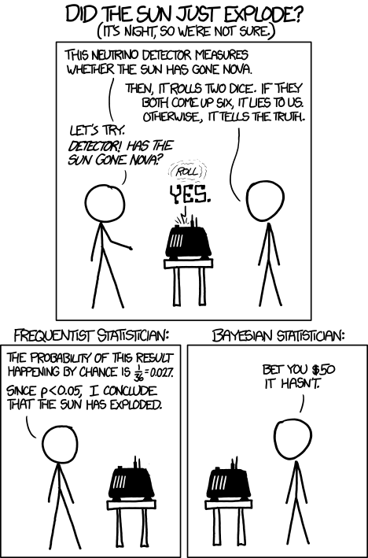

layout: true

<div class="my-footer">
  <span style="text-align:center">
    <span> 
      
    </span>
    <a href="https://www.dirkwulff.org/">
      <span style="padding-left:82px"> 
        <font color="#7E7E7E">
          dirkwulff.org
        </font>
      </span>
    </a>
    <a href="https://therbootcamp.github.io/">
      <font color="#7E7E7E">
      New Statistics | September 2021
      </font>
    </a>
    </span>
  </div> 

---


```{r, eval = TRUE, echo = FALSE, warning=F,message=F}
# Code to knit slides

```

```{r setup, include=FALSE}
options(htmltools.dir.version = FALSE)
options(width = 110)
options(digits = 4)

# Load packages
require(tidyverse)
require(BayesFactor)
require(rstanarm)

print2 <- function(x, nlines=10,...) {
   cat(head(capture.output(print(x,...)), nlines), sep="\n")}
```


.pull-left45[

# Bayesianische Statistik

<ul>
  <li class="m1"><span>Introduces priors so that potseriors can be derived from Bayes theorem</high>.</span></li>
  <li class="m2"><span>Advantages</span></li>
  <ul class="level">
    <li><span>Key statistics of interest</span></li>
    <li><span>Characterization of uncertainty</span></li>
    <li><span>Facilitates estimation</span></li>
    <li><span>Naturally accounts for model complexity</span></li>
  </ul>
    
</ul>


<p align = "center" style="padding-top:20px">
<br>
</p>

]

.pull-right45[

<br>
<p align = "center">
<br>
<font style="font-size:10px">from <a = href="https://xkcd.com/1132/">xkcd.com</a></font>
</p>

]

---

.pull-left45[

# Bayesianische Statistik

<ul>
  <li class="m1"><span>Bayesianische Statistik war <high>lange unpopular</high>.</span></li>
  <ul>
    <li><span>Es ist <high>komputational anspruchsvoll</high> <mono>p(D)</mono> zu berechnen.</span></li>
    <li><span>Das Festlegen der Prior ist <high>notwendigerweise subjektiv</high>.</span></li>
  </ul>
  <li class="m2"><span>Allerdings hat sich dies geändert.</span></li>
  <ul>
    <li><span>Schnellere Computer/Algorithmen erlauben eine Effiziente Schätzung von <mono>p(D)</mono>.</span></li>
    <li><span>Einsicht, dass Statistik <high>subjektiv</high> ist.</span></li>
    <li><span>Fokus auf <high>ignorante Priors</high>.</span></li>
  </ul>
</ul>

]

.pull-right45[

<br>
<p align = "center">
<br>
<font style="font-size:10px">from <a = href="https://xkcd.com/1132/">xkcd.com</a></font>
</p>

]

---

# Model comparison


---

# Priors


---

# Bayesfactor


---

# Marginal likelihood


---

# Estimation


---

# Posterior

---

# Parameter posterior


---

# Posterior predictive


---

# Bayesian statistics in R

.pull-left45[

<ul>
  <li class="m1"><span>Die Pakete <a href="https://cran.r-project.org/package=rstanarm/"><mono><b>rstanarm</b></mono></a> and
<a href="https://cran.r-project.org/package=BayesFactor/"><mono><b>BayesFactor</b></mono></a> machen Bayesianische Analysen einfach.</span></li>
<ul>

<br>

<table style="cellspacing:0; cellpadding:0; border:none; padding-bottom:30px">
  <col width="25%">
  <col width="20%">
  <col width="55%">
<tr>
  <td bgcolor="white">
    <b>Function</b>
  </td>
  <td bgcolor="white">
    <b>Package</b>
  </td>  
  <td bgcolor="white">
    <b>Description</b>
  </td>
</tr>
<tr>
  <td bgcolor="white">
    <mono>stan_glm</mono>, <mono>stan_glmer</mono>
  </td>
  <td bgcolor="white">
    <mono>rstanarm</mono>
  </td>
  <td bgcolor="white">
    Bayesian (mixed) regression
  </td>
</tr>
<tr>
  <td bgcolor="white">
    <mono>ttestBF</mono>, <mono>anovaBF</mono>
  </td>
  <td bgcolor="white">
    <mono>BayesFactor</mono>
  </td>
  <td bgcolor="white">
    Standard h-tests
  </td>
</tr>
<tr>
  <td bgcolor="white">
    <mono>lmBF</mono>
  </td>
  <td bgcolor="white">
    <mono>BayesFactor</mono>
  </td>
  <td bgcolor="white">
    Bayesian (mixed) regressions
  </td>
</tr>
</table>

```{r, eval = F}
# Baysian stats with rstanarm
library(rstanarm)

stan_glm(formula = income ~ height,
         data = baselers)
```

]

.pull-right5[

```{r, include = FALSE}
library(rstanarm)

# Baysian stats with rstanarm
stan_res <- stan_glm(formula = income ~ height,
     data = baselers[!is.na(baselers$income) & !is.na(baselers$height),][1:300,])
```

```{r, echo = F}
options(width = 45)
print2(stan_res, 21)
```

]

---

# Bayesian statistics

.pull-left45[

<ul>
  <li class="m1"><span>Die Pakete <a href="https://cran.r-project.org/package=rstanarm/"><mono><b>rstanarm</b></mono></a> and
<a href="https://cran.r-project.org/package=BayesFactor/"><mono><b>BayesFactor</b></mono></a> machen Bayesianische Analysen einfach.</span></li>
<ul>

<br>

<table style="cellspacing:0; cellpadding:0; border:none; padding-bottom:30px">
  <col width="25%">
  <col width="20%">
  <col width="55%">
<tr>
  <td bgcolor="white">
    <b>Function</b>
  </td>
  <td bgcolor="white">
    <b>Package</b>
  </td>  
  <td bgcolor="white">
    <b>Description</b>
  </td>
</tr>
<tr>
  <td bgcolor="white">
    <mono>stan_glm</mono>, <mono>stan_glmer</mono>
  </td>
  <td bgcolor="white">
    <mono>rstanarm</mono>
  </td>
  <td bgcolor="white">
    Bayesian (mixed) regression
  </td>
</tr>
<tr>
  <td bgcolor="white">
    <mono>ttestBF</mono>, <mono>anovaBF</mono>
  </td>
  <td bgcolor="white">
    <mono>BayesFactor</mono>
  </td>
  <td bgcolor="white">
    Standard h-tests
  </td>
</tr>
<tr>
  <td bgcolor="white">
    <mono>lmBF</mono>
  </td>
  <td bgcolor="white">
    <mono>BayesFactor</mono>
  </td>
  <td bgcolor="white">
    Bayesian (mixed) regressions
  </td>
</tr>
</table>

```{r, eval = F}
# Baysian stats with rstanarm
library(rstanarm)

stan_glm(formula = income ~ height,
         data = baselers)
```

]

.pull-right5[

```{r, include = FALSE}
# Baysian stats with BayesFactor
library(BayesFactor)

bf_res <- lmBF(formula = income ~ height,
     data = baselers[!is.na(baselers$income) & !is.na(baselers$height),][1:300,])
```

```{r, echo = F}
options(width = 45)
print2(bf_res, 21)
```

]

---

Bayes factor is generalization of bayes factor


--- 

# Critiques of bayes factors

sensitivity to prior

Single value assessment

Model selection, rather than model comparison

Often associated with improbable point nulls

--- 

# Benefits

generalization of likelihood ratio

insensitive to optional stopping


---

# Bayes factor

Posterior odds = Evidence + prior odds

Marginal likelihood!!!

Bayes factor is ratio of average likelihood of model

---

class: middle, center

<h1><a href="https://therbootcamp.github.io/SmR_2021Apr/_sessions/NewStats/NewStats_practical.html">Practical</a></h1>

