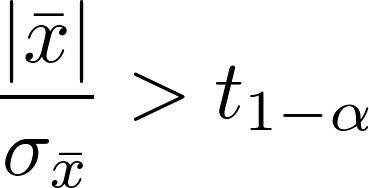

layout: true

<div class="my-footer">
  <span style="text-align:center">
    <span> 
      
    </span>
    <a href="https://www.dirkwulff.org/">
      <span style="padding-left:82px"> 
        <font color="#7E7E7E">
          dirkwulff.org
        </font>
      </span>
    </a>
    <a href="https://therbootcamp.github.io/">
      <font color="#7E7E7E">
      New Statistics | September 2021
      </font>
    </a>
    </span>
  </div> 

---


```{r, eval = TRUE, echo = FALSE, warning=F,message=F}
# Code to knit slides

```

```{r setup, include=FALSE}
options(htmltools.dir.version = FALSE)
options(width = 110)
options(digits = 4)

# Load packages
require(tidyverse)
require(pwr)

print2 <- function(x, nlines=10,...) {
   cat(head(capture.output(print(x,...)), nlines), sep="\n")}


knitr::opts_chunk$set(dpi = 300, echo = FALSE, warning = FALSE, fig.align = 'center', message= FALSE)

```


.pull-left4[

# Bem

<ul>
  <li class="m1"><span>In 2011, Bem published his infamous psi-study, that played a significant role in the early days of the replication crisis.</span></li>
<li class="m2"><span>These are the instructions to study 1:<br><br></span></li>
<li class="m3"><span>Bem recorded hit rates > 50%. Is this possible?</span></li>
</ul>


]


.pull-right5[
<p align = "center" >
<br><br>
  <br>
  <font style="font-size:16px">from <a href="https://www.scientificamerican.com/article/extrasensory-pornception/">Scientific American</a></font>
</p>

]

---


.pull-left35[

# Fundamental model

<ul>
  <li class="m1"><span>Assume there is some model or population underlying the data.</span></li>
  <li class="m2"><span>Using the model and the data we hope to make inferences back on the popoulation.</span></li>
</ul>

]

.pull-right5[

<br>

<p align = "left" >
  
</p>

]

---


.pull-left3[

# H0 model

<ul>
  <li class="m1"><span>Every statistical inference begins with assumptions about the populations.</span></li>
  <li class="m2"><span>Oftentimes this model is a counterfactual that we hope to discredit.</span></li>
  </ul>
</ul>


]

.pull-right6[

<p align = "left" >
  
</p>

]

---

.pull-left3[

# Data model

<ul>
  <li class="m1"><span>The data model describes how empirical data should be distributed according to the H0.</span></li>
  <li class="m2"><span>Also known as the likelihood function.</span></li>
</ul>

<br>

$$Pr(Data|H0) = Distribution$$
]

.pull-right6[

<p align = "left" >
  
</p>

]

---

.pull-left3[

# Data under H0

<ul>
  <li class="m1"><span>Using the data model we can simulate random draws to observe how statistics of the data should be distrbuted under H0</span></li>
</ul>

]

.pull-right6[

<p align = "left" >
  
</p>

]

---

.pull-left3[

# Test statistic

<ul>
  <li class="m1"><span>Test statistics are specific statistics derived from samples.</span></li>
  <li class="m2"><span>In many cases test statistics follow specific distributions carrying the same name, such as, <mono>t</mono>.</li></span>
  </ul>
</ul>

]

.pull-right6[

<p align = "left" >
  
</p>

]

---

.pull-left3[

# Sample distribution

<ul>
  <li class="m1"><span>The sample distribution is the distribition of sample test statistics, e.g., t.</span></li>
</ul>


]

.pull-right6[

<p align = "left" >
  
</p>

]

---

.pull-left3[

# <i>p</i>-value

<ul>
  <li class="m1"><span>p-value is used to determine the weirdness of the data given the H0 model.</span></li>
  <li class="m2"><span>It is defined as the probability of obtaining this or more extreme result under H0.</span></li>
</ul>
]

.pull-right6[

<p align = "left" >
  
</p>

]

---

.pull-left3[

# Test distribition

<ul>
  <li class="m1"><span>In reality we have typically access to an analytical distribution because of smart people.</span></li>
  <li class="m2"><span>These distributions depend often on degrees of freedom (df).</span></li>
</ul>


]

.pull-right6[

<p align = "left" >
  
</p>

]


---


# What's p-value

<br><br>

<p align="center" style="font-size:30px">
1: The probability that H0 is true.
<br><br><br>
2: The probability the result will replicate. 
<br><br><br>
3: A measure of evidence against the H0.
</p>

---

.pull-left45[

# Beyond p-values

<ul>
  <li class="m1"><span>Problems with <i>p</i>-values</span></li>
  <ul>
    <li><span>Commonly misinterpreted.</span></li>
    <li><span>Highly influenced by sample size.</span></li>
    <li><span>Not the most informative metric.</span></li>
  </ul><br>
  <li class="m2"><span>"New" statistics.</span></li>
  <ul>
    <li><span>Focus location / magnitude of effect.</span></li>
    <li><span>Consider uncertainty.</span></li>
  </ul>
</ul>

<br><br><br>

$$Confidence\,Interval\,(CI) = \bar{x} \pm t_{1-\alpha} \sigma_{\bar{x}}$$

]

.pull-right45[

<br>
<p align = "center">
<br>
</p>

]

---

.pull-left45[

# Confidence interval

<ul>
  <li class="m1"><span>Rearranged statistical tests.</span></li>
</ul>

<table style="cellspacing:0; cellpadding:0; border:none; padding-top:10px">
  <col width="30%">
  <col width="70%">
<tr>
  <td bgcolor="white">
    t-test
  </td>
  <td bgcolor="white" style="padding-top:15px;padding-bottom:15px">
    <br>
  </td>
</tr>
<tr>
  <td bgcolor="white">
    Step 1
  </td>
  <td bgcolor="white" style="padding-top:15px;padding-bottom:15px">
    <br>
  </td>
</tr>
<tr>
  <td bgcolor="white">
    Step2
  </td>
  <td bgcolor="white" style="padding-top:15px;padding-bottom:15px;bgcolor:white">
    <br>
  </td>
</tr>
<tr>
  <td bgcolor="white">
    CI
  </td>
  <td bgcolor="white" style="padding-top:15px;padding-bottom:15px">
    
    
  </td>
</tr>
</table>


]

.pull-right45[

<br>
<p align = "center">
<br>
</p>

]


---

# Effect sizes

.pull-left45[

<ul>
  <li class="m1"><span>Whether or not an effect is significant is irrelevant, if the effect is not of meaningful magnitude</span></li>
  <li class="m2"><span>There are several related effect size statistics depending on the test.</span></li>
</ul>

<br>

<table style="cellspacing:0; cellpadding:0; border:none; padding-top:10px">
  <col width="50%">
  <col width="50%">
<tr>
  <td bgcolor="white">
    <b>Situation</b>
  </td>
  <td bgcolor="white">
    <b>Mass</b>
  </td>  
</tr>
<tr>
  <td bgcolor="white">
    Mittelwertsvergleiche
  </td>
  <td bgcolor="white">
    Cohen's <i>d</i><br>Hedge's <i>g</i><br>&eta;<sup>2</sup><br>
  </td>  
</tr>
<tr>
  <td bgcolor="white">
    Korrelation, Regression 
  </td>
  <td bgcolor="white">
   <i>r</i><br>R<sup>2</sup><br>f<sup>2</sup>
  </td>  
</tr>
</table>

]

.pull-right5[

<br>
<p align = "center">
<br>
</p>

]


---


# Power

.pull-left4[


<ul>
  <li class="m1"><span>Die Grösse der Stichprobe sollte die nötige <high>Trennschärfe für das Detektieren eines Effekts ermöglichen</high></high></span></li>
  <li class="m2"><span>Grössere Stichproben &rarr; <high>schmalere Stichprobenverteilungen</high> &rarr; höhere Trennschärfe.</span></li>
</ul>

<p align = "center">
<br>
</p>

]


.pull-right5[

<p align = "center">
<br>
</p>

]

---

# Sample size planning

.pull-left4[

<ul>
  <li class="m1"><span>Die Grösse der Stichprobe sollte die nötige <high>Trennschärfe für das Detektieren eines Effekts ermöglichen</high></high>.</span></li>
  <li class="m2"><span>Grössere Stichproben &rarr; <high>schmalere Stichprobenverteilungen</high> &rarr; höhere Trennschärfe.</span></li>
</ul>

<p align = "center">
<br>
</p>

]

.pull-right5[

<p align = "center">
<br>
</p>

]

---

# Sample size planning in R

.pull-left4[

<ul>
  <li class="m1"><span>Die Grösse der Stichprobe sollte die nötige <high>Trennschärfe für das Detektieren eines Effekts ermöglichen</high>.</span></li>
  <li class="m2"><span>Grössere Stichproben &rarr; <high>schmalere Stichprobenverteilungen</high> &rarr; höhere Trennschärfe.</span></li>
</ul>

<p align = "center">
<br>
</p>

]

.pull-right5[

```{r, echo = TRUE}
# Lade pwr Paket
library(pwr)

# N für einen grossen Effekt im t-test
pwr.t.test(sig.level = .05, 
           power = .95, 
           d = .2) # grosser Effekt
```

]
---

# Sample size planning in R

.pull-left4[

<ul>
  <li class="m1"><span>Die Grösse der Stichprobe sollte die nötige <high>Trennschärfe für das Detektieren eines Effekts ermöglichen</high>.</span></li>
  <li class="m2"><span>Grössere Stichproben &rarr; <high>schmalere Stichprobenverteilungen</high> &rarr; höhere Trennschärfe.</span></li>
</ul>

<p align = "center">
<br>
</p>

]

.pull-right5[

```{r, echo = TRUE}
# Lade pwr Paket
library(pwr)

# N für einen grossen Effekt im t-test
pwr.t.test(sig.level = .05, 
           power = .95, 
           d = .8) # grosser Effekt
```

]

---

# Sample size planning in R

.pull-left4[

<ul>
  <li class="m1"><span>Die Grösse der Stichprobe sollte die nötige <high>Trennschärfe für das Detektieren eines Effekts ermöglichen</high>.</span></li>
  <li class="m2"><span>Grössere Stichproben &rarr; <high>schmalere Stichprobenverteilungen</high> &rarr; höhere Trennschärfe.</span></li>
</ul>

<p align = "center">
<br>
</p>

]

.pull-right5[

```{r, echo = TRUE}
# Lade pwr Paket
library(pwr)

# N für einen grossen Effekt im t-test
pwr.t.test(sig.level = .05, 
           power = .95, 
           d = .8) # grosser Effekt
```

]


---

# Stichprobenplanung in R

.pull-left4[

<ul>
  <li class="m1"><span>In some cases, </span></li>
</ul>

<p align = "center">
<br>
</p>

]

.pull-right5[

```{r, echo = TRUE}
# Lade pwr Paket
library(pwr)

# N für einen grossen Effekt im t-test
pwr.t.test(sig.level = .05, 
           power = .95, 
           d = .8) # grosser Effekt
```

]

---

# Simulation packages


Superpower 

simr

---

class: middle, center

<h1><a href="https://therbootcamp.github.io/SmR_2021Apr/_sessions/NewStats/NewStats_practical.html">Practical</a></h1>

