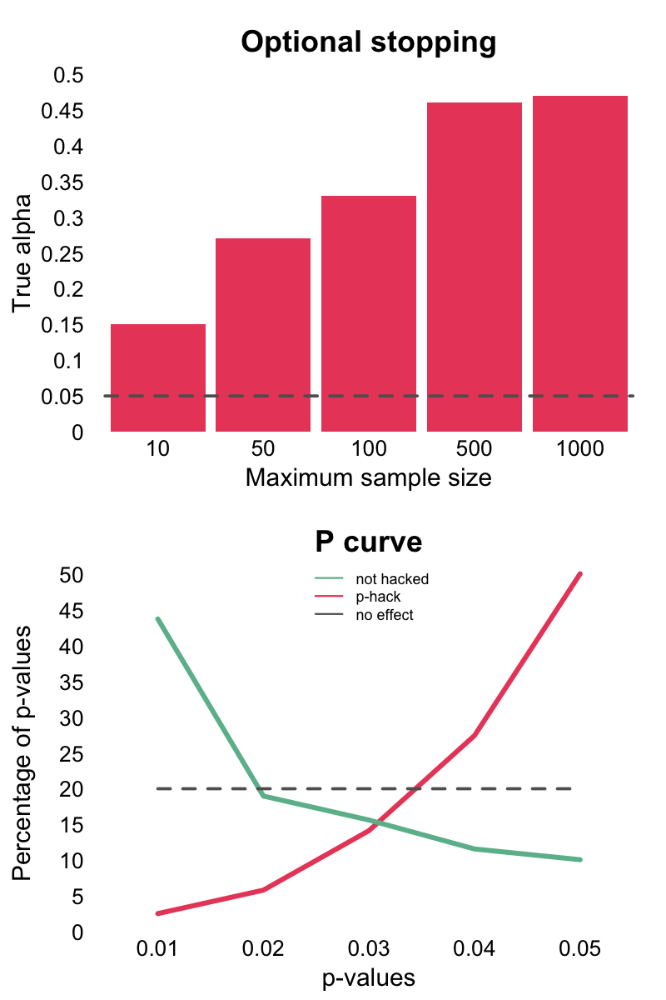

layout: true

<div class="my-footer">
  <span style="text-align:center">
    <span> 
      
    </span>
    <a href="https://www.dirkwulff.org/">
      <span style="padding-left:82px"> 
        <font color="#7E7E7E">
          dirkwulff.org
        </font>
      </span>
    </a>
    <a href="https://therbootcamp.github.io/">
      <font color="#7E7E7E">
      New Statistics | September 2021
      </font>
    </a>
    </span>
  </div> 

---


```{r, eval = TRUE, echo = FALSE, warning=F,message=F}
# Code to knit slides

```

```{r setup, include=FALSE}
options(htmltools.dir.version = FALSE)
options(width = 110)
options(digits = 4)

# Load packages
require(tidyverse)
require(rpact)

print2 <- function(x, nlines=10,...) {
   cat(head(capture.output(print(x,...)), nlines), sep="\n")}

knitr::opts_chunk$set(dpi = 300, echo = FALSE, warning = FALSE, fig.align = 'center', message= FALSE)

```


.pull-left2[

# <i>p</i>-hacking

<high><i>“If you torture the data long enough, it will confess.”</i></high>

Ronald Coase

<br><br><br><br><br><br><br><br><br><br><br><br>

<p align="right"><font style="font-size:10px">from <a href="https://fivethirtyeight.com/features/science-isnt-broken/#part1">fivethirtyeight.com</a></font>
</p>


]


.pull-right75[
<br>
<iframe src="https://projects.fivethirtyeight.com/p-hacking/index.html?initialWidth=1024&amp;childId=phacking&amp;parentTitle=Science%20Isn%E2%80%99t%20Broken%20%7C%20FiveThirtyEight&amp;parentUrl=https%3A%2F%2Ffivethirtyeight.com%2Ffeatures%2Fscience-isnt-broken%2F" width="100%" scrolling="yes" marginheight="0" frameborder="0" height="550px"></iframe>

]

---

.pull-left45[

# <i>p</i>-hacking

<ul>
  <li class="m1"><span><i>p</i>-hacking bezeichnet des Missbrauch von Datenanalyse, um <high>Effekte zu zeigen wo es eigentlich keine gibt</high>.</span></li><br>
  <li class="m2"><span><high>Optionales Stoppen</high><br><br>Stoppen der Datenanalyse sobald Signifikanz erreicht wurde.</span></li><br>
  <li class="m3"><span><high>HARKing</high><br><br>Hypothesizing After the Data are Known. Geschieht wenn nicht-geplante Analysen als geplant dargestellt werden.</span></li>
</ul>

]


.pull-right45[
<br>
<p align = "center">
<br>
</p>

]


---

class: middle, center

<h1><a href="https://therbootcamp.github.io/SmR_2021Apr/_sessions/NewStats/NewStats_practical.html">Practical</a></h1>

