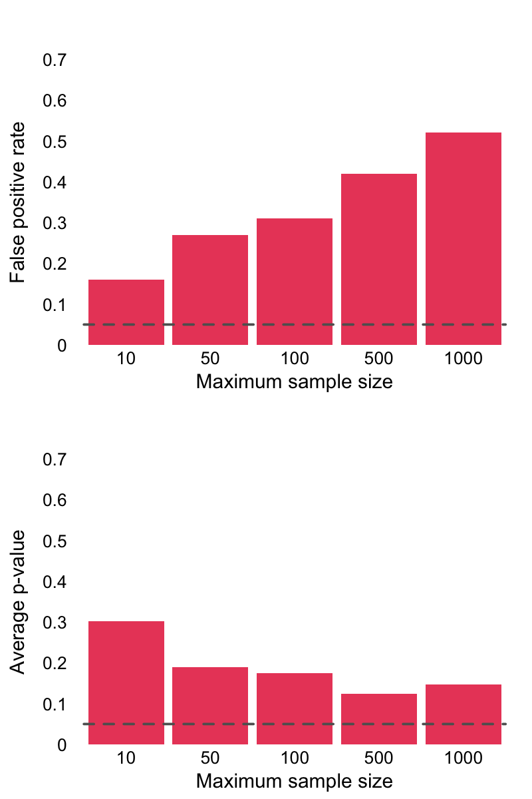

layout: true

<div class="my-footer">
  <span style="text-align:center">
    <span> 
      
    </span>
    <a href="https://www.dirkwulff.org/">
      <span style="padding-left:82px"> 
        <font color="#7E7E7E">
          dirkwulff.org
        </font>
      </span>
    </a>
    <a href="https://therbootcamp.github.io/">
      <font color="#7E7E7E">
      New Statistics | September 2021
      </font>
    </a>
    </span>
  </div> 

---


```{r, eval = TRUE, echo = FALSE, warning=F,message=F}
# Code to knit slides

```

```{r setup, include=FALSE}
options(htmltools.dir.version = FALSE)
options(width = 110)
options(digits = 4)

# Load packages
require(tidyverse)
require(rpact)

print2 <- function(x, nlines=10,...) {
   cat(head(capture.output(print(x,...)), nlines), sep="\n")}

knitr::opts_chunk$set(dpi = 300, echo = FALSE, warning = FALSE, fig.align = 'center', message= FALSE)

```


.pull-left45[

# Optional stopping

<ul>
  <li class="m1"><span>To stop data collection after significance or some other threshold is reached is often considered a questionable research practice (QRP).</span></li><br>
  <li class="m2"><span>In a NHST approach, optional stopping results in an inflation of false positive decisions.</span></li>
</ul>

]


.pull-right45[
<br>
<p align = "center">
<br>
</p>

]


---

.pull-left45[

# Bayesian optional stopping

<ul>
  <li class="m1"><span>Bayesian statistics is less susceptible to optional stopping.</span></li><br>
  <li class="m2"><span>The false positive rate will not be larger than the posterior probability used as the theshold. <span></li>
  <li class="m3"><span>Example implements BF10 > 3 as the threshold, implying a false positive rate under optional stopping of at most .33.<span></li>
</ul>

]


.pull-right45[

<br>
<p align = "center">
<br>
</p>

]


---

.pull-left45[

# Alpha reduction

<ul>
  <li class="m1"><span>One approach to dealing with the inflation of false positiv rates is to reduce each alpha sufficiently so the overall false positive rate is limited to alpha.</span></li>
  <li class="m2"><span>Constant alpha approaches come with a heavy price in power.</span></li>  
</ul>

]


.pull-right45[
<br>
<p align = "center">
<br>
</p>

]

---

.pull-left45[

# Alpha spending

<ul>
  <li class="m1"><span>Alpha spending approaches attempt to distribute alpha in a way that the false positive rate is held constant, and power is optimized.</span></li>
  <li class="m2"><span>Several proposals exist, that achieve comparable power to non-sequential tests, but do so with fewer samples.</span></li>
</ul>

<br><br>

$$\alpha_t = 4 - 4*\Phi\Bigg(\frac{\Phi^{-1}(1-\frac{\alpha}{4})}{\sqrt{t}}\Bigg) $$

]


.pull-right45[
<br>
<p align = "center">
<br>
</p>

]


---

.pull-left25[

# Sequential analysis in R

<ul>
  <li class="m1">The <mono>rpact</mono> package gives access to all sorts of methods to determine appropriate alpha levels.</span></li>
</ul>

```{r, eval = FALSE, echo=TRUE}
# determine appropriate 
# sequential analysis 
getDesignGroupSequential(
  alpha = .05, 
  informationRates = 
    seq(.1, 1, .1), 
  sided = 2)

```
]


.pull-right7[
<br><br>
```{r, echo  = FALSE}
getDesignGroupSequential(
  alpha = .05, 
  informationRates = 
    seq(.1, 1, .1), 
  sided = 2)
```
]

---

.pull-left25[

# Sequential analysis in R

<ul>
  <li class="m1">The <mono>rpact</mono> package gives access to all sorts of methods to determine appropriate alpha levels.</span></li>
</ul>

```{r, eval = FALSE, echo=TRUE}
# determine appropriate 
# sequential analysis 
getDesignGroupSequential(
  alpha = .05, 
  informationRates = 
    seq(.1, 1, .1), 
  sided = 2) %>% 
  plot()

```
]


.pull-right7[
<br><br>
```{r, echo  = FALSE, fig.asp=.7}
getDesignGroupSequential(
  alpha = .05, 
  informationRates = 
    seq(.1, 1, .1), 
  sided = 2) %>% plot()
```
]

---

class: middle, center

<h1><a href="https://dwulff.github.io/newstats/_sessions/sequential_analysis/sequential_analysis_practical.html">Practical</a></h1>

