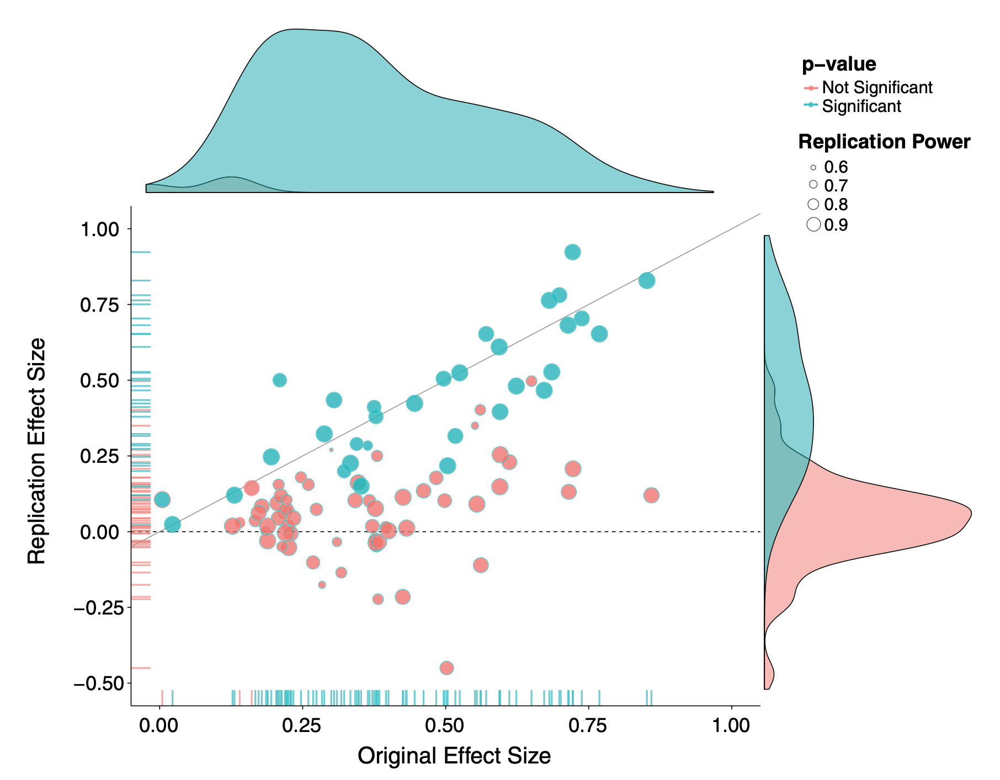
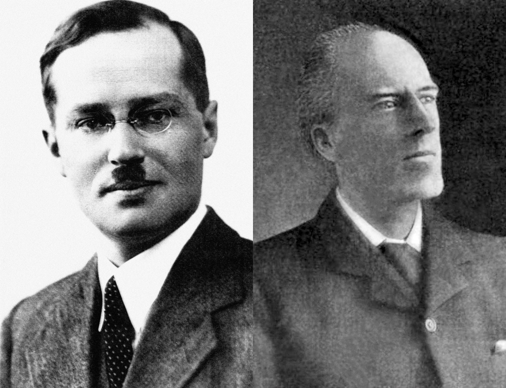
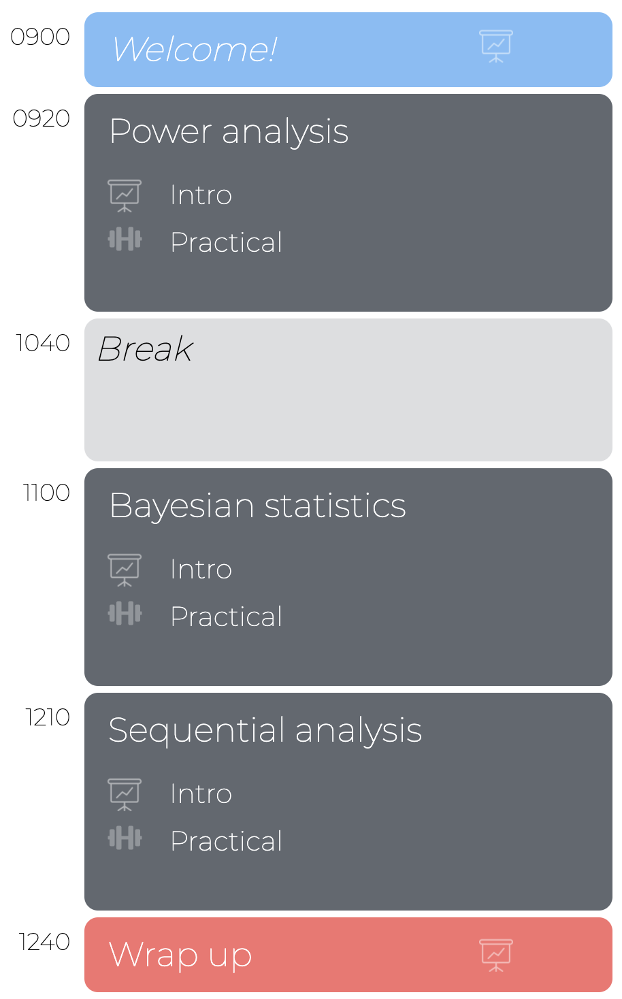

layout: true

<div class="my-footer">
  <span style="text-align:center">
    <span> 
      
    </span>
    <a href="https://www.dirkwulff.org/">
      <span style="padding-left:82px"> 
        <font color="#7E7E7E">
          dirkwulff.org
        </font>
      </span>
    </a>
    <a href="https://therbootcamp.github.io/">
      <font color="#7E7E7E">
      New Statistics | September 2021
      </font>
    </a>
    </span>
  </div> 

---


```{r setup, include=FALSE}
options(htmltools.dir.version = FALSE)
options(width=110)
options(digits = 4)

knitr::opts_chunk$set(fig.align = 'center')
```

.pull-left45[
<br><br><br><br><br>
# Materials


Everything available at

<font style="font-size:28px"><a href="https://dwulff.github.io/newstats/"><b>dwulff.github.io/newstats</b></a></font>

]

.pull-right5[

<br><br>
<iframe src="https://dwulff.github.io/newstats/" width="500" height="500"></iframe>

]

---

.pull-left6[

<br><br><br><br><br>


# Goal


>###The goal of this course is to introduce you to the background and implementation in R of statistical approaches beyond basic null hypothesis significance testing (NHST) that can help address the replication crisis. 

]

.pull-right4[

<br><br><br><br>
<p align="center"></p>

]

---

# Replication crisis

.pull-left4[

<ul>
  <li class="m1"><span>Mutiple academic fields incl. Psychology are dealing with replication crises.</span></li>
  <li class="m2"><span>The replication effort of OSF yieled <high>only 36% successful replications</high>.</span></li>
  <li class="m3"><span>The low replication rate has been attributed to multiple factors including <high>Questionable Research Practices</high>.</span></li>
</ul>

<br><br>
See comparable studies<br>
[**Medicine**](https://therbootcamp.github.io/SwR_2019Apr/_sessions/NewStats/literature/Ioannidis2005.pdf), [**Economics**](https://therbootcamp.github.io/SwR_2019Apr/_sessions/NewStats/literature/Camerer2016.pdf), [**Marketing**](https://therbootcamp.github.io/SwR_2019Apr/_sessions/NewStats/literature/Hunter2001.pdf), [**Social sciences**](https://therbootcamp.github.io/SwR_2019Apr/_sessions/NewStats/literature/Camerer2018.pdf). 

]


.pull-right5[

<p align = "center">
<br>
<font style="font-size:10px">from <a href="https://ink.library.smu.edu.sg/cgi/viewcontent.cgi?article=6256&context=lkcsb_research">Open Science Collaboration</a></font>
</p>

]

---

# Proposals

.pull-left4[
<ul>
  <li class="m1"><span>Stronger theories</span></li>
  <li class="m2"><span>Informative Designs</span></li>
  <li class="m3"><span><high>Sample size planning</high></span></li>
  <li class="m4"><span><high>Focus on estimation</high></span></li>
  <li class="m5"><span>Registrations </span></li>
  <li class="m6"><span>Don't <i>p</i>-hack</span></li>
  <li class="m7"><span>Complete reporting</span></li>
  <li class="m8"><span>Replikation</span></li>
  <li class="m9"><span>Open materials</span></li>
</ul>

]

.pull-right5[

<p align = "center">
<br>
<font style="font-size:10px">adapted from <a href="https://www.someecards.com/usercards/viewcard/MjAxMy0zOGE1Mzg3YjY4YzE1NTA0/?tagSlug=birthday">Someecards.com</a></font>
</p>

]


---

<!---
# Three perspectives

<table width="100%" style="cellspacing:0; cellpadding:0; border:none;">

  <tr>    

  <td style="padding:40px"> 
  <p align="center">
  
  <br><b>R. A. Fisher</b><br>(1890-1962)
  </p>
  </td>

  <td style="padding:40px">
  <p align="center">
  
  <br><b>J. Neyman</b> (1894-1981) and<br><b>K. Pearson</b> (1857-1936)
  </p>
  </td>

  <td style="padding:40px"> 
  <p align="center">
  
  <br><b>T. Bayes</b><br>(1702-1761)
  </p>
  </td>

  </tr>

</table>

--->

.pull-left45[

<br>
# Schedule 

<ul>
  <li class="m1"><span>The Workshop consists of <high> three central blocks</high>.</span></li>
  <li class="m2"><span>Blocks</span></li>
  <ul class="level">
    <li><span>Slide-based introduction</high></span></li> 
    <li><span>Step-by-step <high>practical exercises</high></span></li> 
    <li><span>Interaktive discussion of <high>solutions</high></span></li> 
  </ul>
</ul>


]

.pull-right4[
<br><br>


]

´
---

# Introductions

.pull-left4[    

<ul>
  <li class="m1"><span>Who are you?</span></li>
  <li class="m2"><span>What types of statistical analysis are central in your work?</span></li>
  <li class="m3"><span>What statistical software do you use most in your work?</span></li>
</ul>


]

.pull-right45[

<p align="center">

<br>
<font style="font-size:10px">from <a href="www.artofmanliness.com">artofmanliness.com</a></font>
</p>

]

---
class: middle, center

<h1><a href=https://dwulff.github.io/newstats/index.html>Schedule</a></h1>


