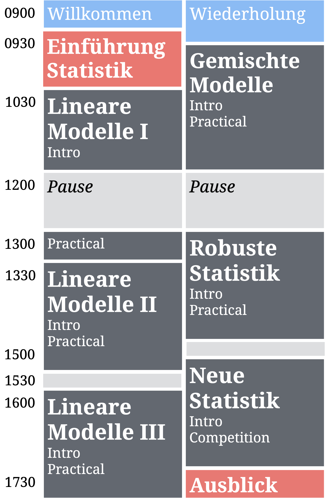
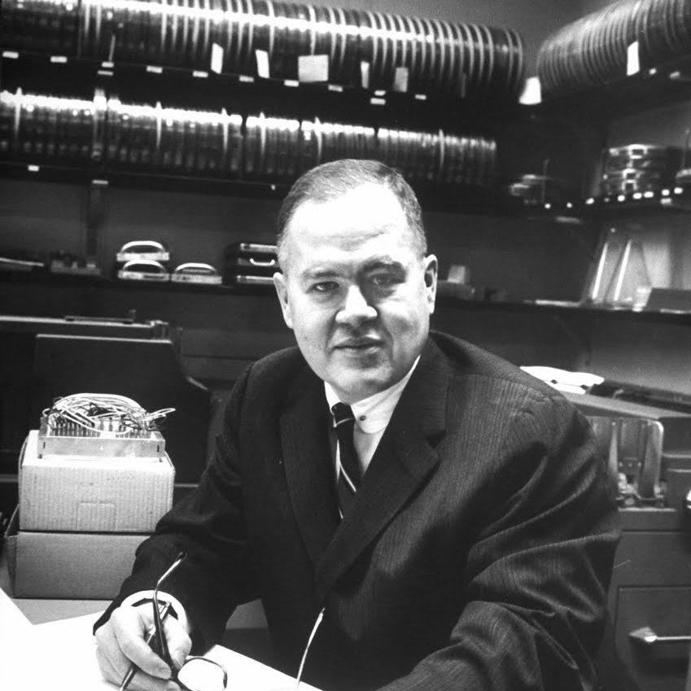
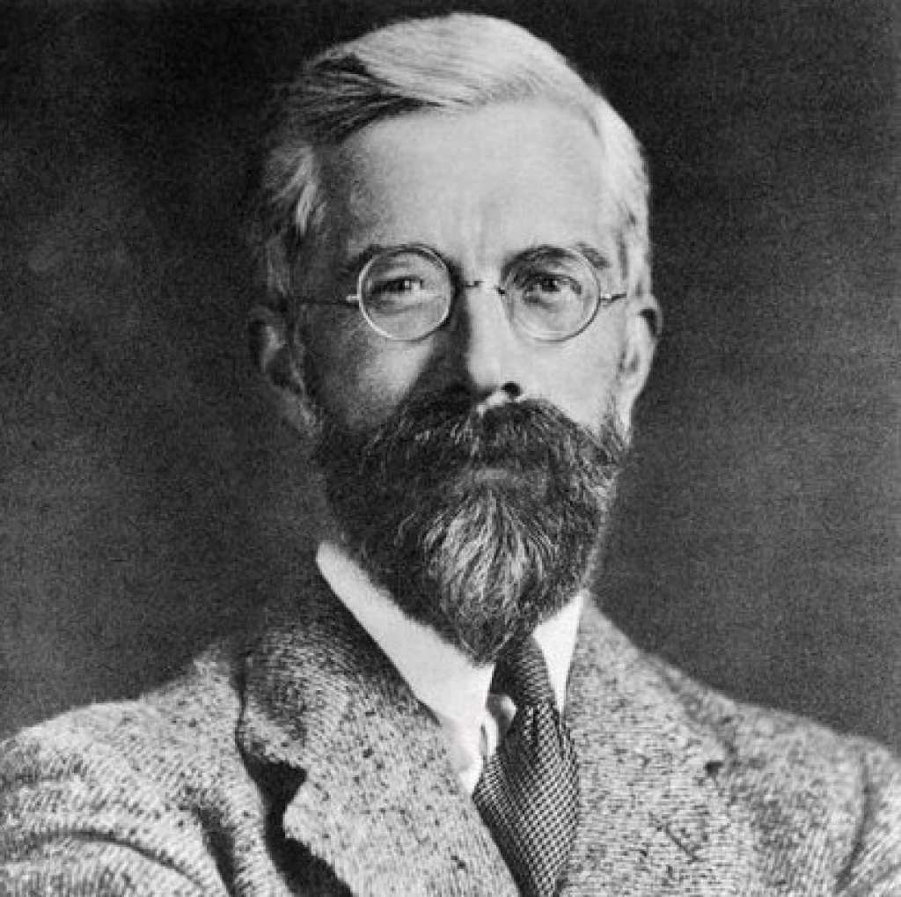
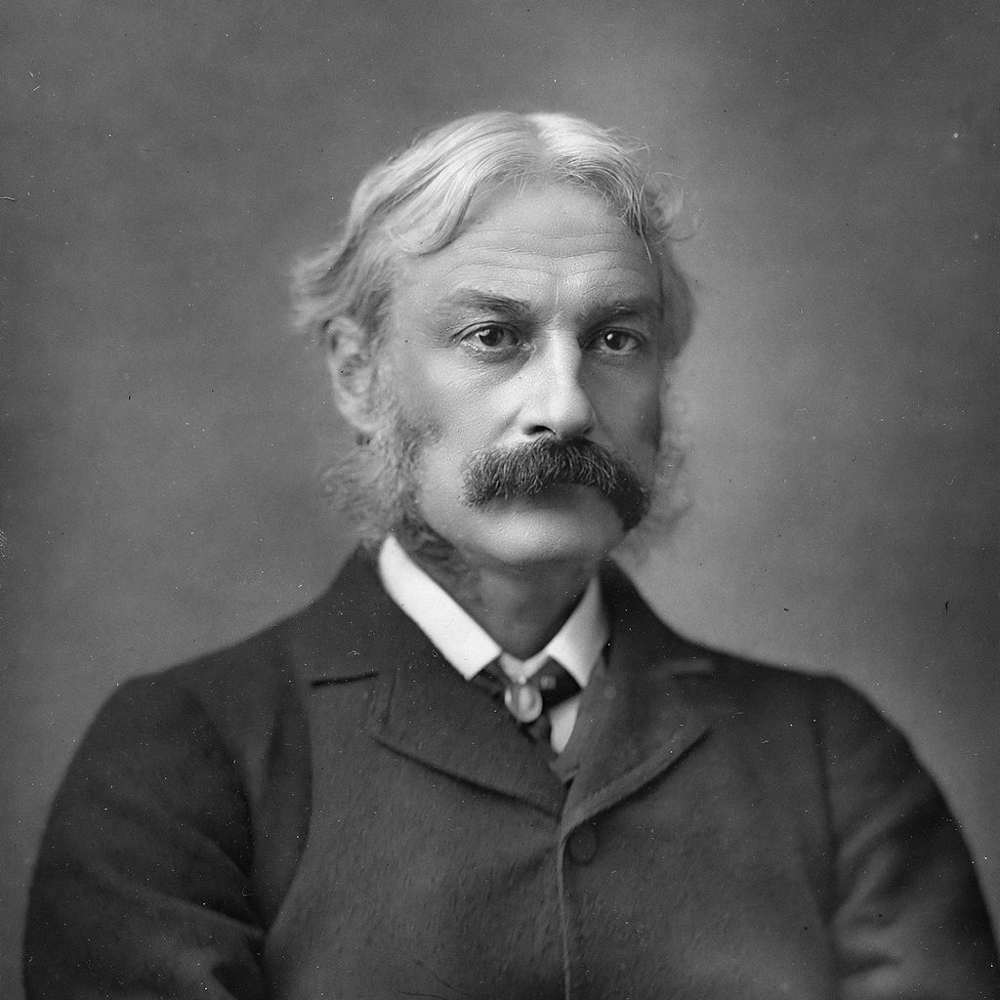
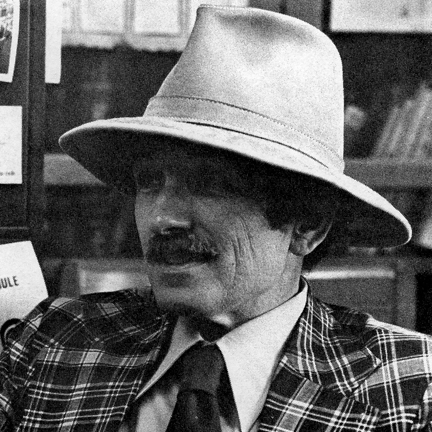

layout: true

<div class="my-footer">
  <span style="text-align:center">
    <span> 
      
    </span>
    <a href="https://www.dirkwulff.org/">
      <span style="padding-left:82px"> 
        <font color="#7E7E7E">
          dirkwulff.org
        </font>
      </span>
    </a>
    <a href="https://therbootcamp.github.io/">
      <font color="#7E7E7E">
      New Statistics | September 2021
      </font>
    </a>
    </span>
  </div> 

---


```{r setup, include=FALSE}
options(htmltools.dir.version = FALSE)
options(width=110)
options(digits = 4)

knitr::opts_chunk$set(fig.align = 'center')
```


.pull-left45[

<br>
# Schedule 

<ul>
  <li class="m1"><span>Der Workshop beinhaltet fünf <high>halbstündige R Blöcke</high> (in grau).</span></li>
  <li class="m2"><span>Blöcke</span></li>
  <ul class="level">
    <li><span>Folien-basierten <high>Einführung (10min)</high></span></li> 
    <li><span>Selbsständige <high>Übung (15min)</high></span></li> 
    <li><span>Interaktive <high>Lösungen (5min)</high></span></li> 
  </ul>
</ul>


]

.pull-right4[
<br><br>


]

---


<table style="cellspacing:0; cellpadding:0; border:none; padding-top:50px" width=90%>
  <col width="42%">
  <col width="5%">
  <col width="42%">
  <tr>
  <td bgcolor="white" align="center">
    <br>
    <font style="font-size:10px"> from <a href="https://anomaly.io/about/">nomaly.io</a>
  </td>
  <td bgcolor="white" align="center">
  </td>
  <td bgcolor="white" align="center">
    <br>
    <font style="font-size:10px"> from <a     href="https://artsandculture.google.com/entity/m025r9k">artsandculture.google.com</a>
  </td>  
</tr>

<tr>
  <td bgcolor="white" align="center" width="50%">
     <br><font style="font-size:22px"><high>"All models are wrong, but some are useful."</high></font>
  </td>
  <td bgcolor="white" align="center">
  </td>
  <td bgcolor="white" align="center">
     <br><font style="font-size:22px"><high>"An approximate answer to the right problem is worth a good deal more than an exact answer to an approximate problem."</high></font><br><br>
    
  </td>  
</tr>

<tr>
  <td bgcolor="white" align="center">
     <font style="font-size:22px">George E. P. Box</font><br>
     <font style="font-size:14px">1919-2013</font>
  </td>
  <td>
  </td>
  <td bgcolor="white" align="center">
    <font style="font-size:22px">John W. Tukey</font><br>
     <font style="font-size:14px">1915-2000</font>
  </td>  
</tr>

</table>

---


<table style="cellspacing:0; cellpadding:0; border:none; padding-top:50px" width=90%>
  <col width="42%">
  <col width="5%">
  <col width="42%">
  <tr>
  <td bgcolor="white" align="center">
    <br>
    <font style="font-size:10px"> from <a href="https://www.hamhigh.co.uk/news/heritage/">hamhigh.co.uk</a>
  </td>
  <td bgcolor="white" align="center">
  </td>
  <td bgcolor="white" align="center">
    <br>
    <font style="font-size:10px"> from <a     href="https://en.wikiquote.org/wiki/Andrew_Lang ">wikiquote.org</a>
  </td>  
</tr>

<tr>
  <td bgcolor="white" align="center" width="50%">
     <br><font style="font-size:22px"><high>"To call in the statistician after the experiment is done may be no more than asking him to perform a post-mortem examination: he may be able to say what the experiment died of."</high></font>
  </td>
  <td bgcolor="white" align="center">
  </td>
  <td bgcolor="white" align="center">
     <br><font style="font-size:22px"><high>"[He] uses statistics like a drunken man uses a lamp post, more for support than illumination."</high></font><br><br>
    
  </td>  
</tr>

<tr>
  <td bgcolor="white" align="center">
     <font style="font-size:22px">Ronald A. Fisher</font><br>
     <font style="font-size:14px">1890-1962</font>
  </td>
  <td>
  </td>
  <td bgcolor="white" align="center">
    <font style="font-size:22px">Andrew Lang</font><br>
     <font style="font-size:14px">1844-1912</font>
  </td>  
</tr>

</table>

---


<table style="cellspacing:0; cellpadding:0; border:none; padding-top:50px" width=90%>
  <col width="42%">
  <col width="5%">
  <col width="42%">
  <tr>
  <td bgcolor="white" align="center">
    <br>
    <font style="font-size:10px"> from <a href="https://www.independent.co.uk/arts-entertainment/">independent.co.uk</a>
  </td>
  <td bgcolor="white" align="center">
  </td>
  <td bgcolor="white" align="center">
    <br>
    <font style="font-size:10px"> from <a href="https://www.americanscientist.org/">americanscientist.org</a>
  </td>  
</tr>

<tr>
  <td bgcolor="white" align="center" width="50%">
     <br><font style="font-size:22px"><high>"Statistical thinking will one day be as necessary a qualification for efficient citizenship as the ability to read and write."</high></font>
  </td>
  <td bgcolor="white" align="center">
  </td>
  <td bgcolor="white" align="center">
     <br><font style="font-size:22px"><high>"It's easy to lie with statistics; it is easier to lie without them."</high></font><br><br>
    
  </td>  
</tr>

<tr>
  <td bgcolor="white" align="center">
     <font style="font-size:22px">H. G. Wells</font><br>
     <font style="font-size:14px">1866-1946</font>
  </td>
  <td>
  </td>
  <td bgcolor="white" align="center">
    <font style="font-size:22px">C. Frederick Mosteller</font><br>
     <font style="font-size:14px">1916-2006</font>
  </td>  
</tr>

</table>

---

<table style="cellspacing:0; cellpadding:0; border:none; padding-top:50px" width=90%>
  <col width="42%">
  <col width="5%">
  <col width="42%">
  <tr>
  <td bgcolor="white" align="center">
    <br>
    <font style="font-size:10px"> from <a href="http://www.bigear.org/CSMO/HTML/CS06/cs06p13.htm">bigear.org</a>
  </td>
  <td bgcolor="white" align="center">
  </td>
  <td bgcolor="white" align="center">
    <br>
    <font style="font-size:10px"> from <a href="https://de.wikipedia.org/wiki/Ernest_Rutherford">wikipedia.org</a>
  </td>  
</tr>

<tr>
  <td bgcolor="white" align="center" width="50%">
     <br><font style="font-size:22px"><high>"The subjectivist (i.e. Bayesian) states his judgements, whereas the objectivist sweeps them under the carpet by calling assumptions knowledge, and he basks in the glorious objectivity of science."</high></font>
  </td>
  <td bgcolor="white" align="center">
  </td>
  <td bgcolor="white" align="center">
     <br><font style="font-size:22px"><high>"If your experiment needs statistics, you ought to have done a better experiment."</high></font><br><br>
    
  </td>  
</tr>

<tr>
  <td bgcolor="white" align="center">
     <font style="font-size:22px">I. J. Good</font><br>
     <font style="font-size:14px">1916-2009</font>
  </td>
  <td>
  </td>
  <td bgcolor="white" align="center">
    <font style="font-size:22px">Ernest Rutherford</font><br>
     <font style="font-size:14px">1871-1937</font>
  </td>  
</tr>
</table>


---

# Dos and Don'ts

.pull-left5[

<p align="center">

  

  <h style="font-size:60px;position:absolute;bottom:390px;left:168px;color:white">Exploration</h><br>
  <font style="font-size:10px">Columbus looking for India, from <a href="https://www.history.com/topics/exploration">history.com</a></font>
  <br><br>
  
  <font style="font-size:28px"><i>Do</i></font><br><br2>
  
  Everything<br><bt>

  <br><br><br><br><font style="font-size:28px"><i>Don't</i></font><br><br2>
  
  Present results as if they were confirmatory.<br><br>
  
  </font>

</p>

]


.pull-right5[

<p align="center">

  

  <h style="font-size:60px;position:absolute;bottom:390px;left:675px;color:white">Confirmations</h><br>
  <font style="font-size:10px">Villemard vision for 2000, from <a href="https://www.sadanduseless.com/world-in-2000/">sadanduseless.com</a></font>
  <br><br>

  <font style="font-size:28px"><i>Do</i></font><br><br2>
  
  Predict.<br>
  Plan sample size.<br>
  Layout analysis plan.<br>
  Register.<br>

  <br><font style="font-size:28px"><i>Don't</i></font><br><br2>
  
  Don't run unplanned hypotheses.<br><br>
  
  </font>

</p>

</p>

]


---
class: middle, center

<h1><a href=https://therbootcamp.github.io/I2R_2020Aug/index.html>Schedule</a></h1>


