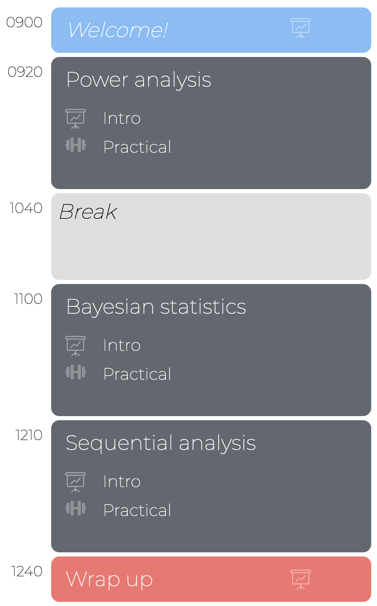

layout: true

<div class="my-footer">
  <span style="text-align:center">
    <span> 
      
    </span>
    <a href="https://www.dirkwulff.org/">
      <span style="padding-left:82px"> 
        <font color="#7E7E7E">
          dirkwulff.org
        </font>
      </span>
    </a>
    <a href="https://therbootcamp.github.io/">
      <font color="#7E7E7E">
      New Statistics | September 2021
      </font>
    </a>
    </span>
  </div> 

---


```{r setup, include=FALSE}
options(htmltools.dir.version = FALSE)
options(width=110)
options(digits = 4)

knitr::opts_chunk$set(fig.align = 'center')
```


.pull-left45[

<br><br><br><br>

# You've made it! 

You've conquered the basics of power analysis, Bayesian statistics, and sequential analysis. 

Kudos to you!

]

.pull-right4[
<br><br>


]

---


<table style="cellspacing:0; cellpadding:0; border:none; padding-top:50px" width=90%>
  <col width="42%">
  <col width="5%">
  <col width="42%">
  <tr>
  <td bgcolor="white" align="center">
    <br>
    <font style="font-size:10px"> from <a href="https://anomaly.io/about/">nomaly.io</a>
  </td>
  <td bgcolor="white" align="center">
  </td>
  <td bgcolor="white" align="center">
    <br>
    <font style="font-size:10px"> from <a     href="https://artsandculture.google.com/entity/m025r9k">artsandculture.google.com</a>
  </td>  
</tr>

<tr>
  <td bgcolor="white" align="center" width="50%">
     <br><font style="font-size:22px"><high>"All models are wrong, but some are useful."</high></font>
  </td>
  <td bgcolor="white" align="center">
  </td>
  <td bgcolor="white" align="center">
     <br><font style="font-size:22px"><high>"An approximate answer to the right problem is worth a good deal more than an exact answer to an approximate problem."</high></font><br><br>
    
  </td>  
</tr>

<tr>
  <td bgcolor="white" align="center">
     <font style="font-size:22px">George E. P. Box</font><br>
     <font style="font-size:14px">1919-2013</font>
  </td>
  <td>
  </td>
  <td bgcolor="white" align="center">
    <font style="font-size:22px">John W. Tukey</font><br>
     <font style="font-size:14px">1915-2000</font>
  </td>  
</tr>

</table>

---


<table style="cellspacing:0; cellpadding:0; border:none; padding-top:50px" width=90%>
  <col width="42%">
  <col width="5%">
  <col width="42%">
  <tr>
  <td bgcolor="white" align="center">
    <br>
    <font style="font-size:10px"> from <a href="https://www.hamhigh.co.uk/news/heritage/">hamhigh.co.uk</a>
  </td>
  <td bgcolor="white" align="center">
  </td>
  <td bgcolor="white" align="center">
    <br>
    <font style="font-size:10px"> from <a href="https://de.wikipedia.org/wiki/Ernest_Rutherford">wikipedia.org</a>
  </td> 
</tr>

<tr>
  <td bgcolor="white" align="center" width="50%">
     <br><font style="font-size:22px"><high>"To call in the statistician after the experiment is done may be no more than asking him to perform a post-mortem examination: he may be able to say what the experiment died of."</high></font>
  </td>
  <td bgcolor="white" align="center">
  </td>
  <td bgcolor="white" align="center">
     <br><font style="font-size:22px"><high>"If your experiment needs statistics, you ought to have done a better experiment."</high></font><br><br>
    
  </td>  
</tr>

<tr>
  <td bgcolor="white" align="center">
     <font style="font-size:22px">Ronald A. Fisher</font><br>
     <font style="font-size:14px">1890-1962</font>
  </td>
  <td>
  </td>
  <td bgcolor="white" align="center">
    <font style="font-size:22px">Ernest Rutherford</font><br>
     <font style="font-size:14px">1871-1937</font>
  </td>  
</tr>

</table>

---

# Proposals

.pull-left4[
<ul>
  <li class="m1"><span>Stronger theories</span></li>
  <li class="m2"><span>Informative Designs</span></li>
  <li class="m3"><span><high>Sample size planning</high></span></li>
  <li class="m4"><span><high>Focus on estimation</high></span></li>
  <li class="m5"><span>Registrations </span></li>
  <li class="m6"><span>Don't <i>p</i>-hack</span></li>
  <li class="m7"><span>Complete reporting</span></li>
  <li class="m8"><span>Replikation</span></li>
  <li class="m9"><span>Open materials</span></li>
</ul>

]

.pull-right5[

<p align = "center">
<br>
<font style="font-size:10px">adapted from <a href="https://www.someecards.com/usercards/viewcard/MjAxMy0zOGE1Mzg3YjY4YzE1NTA0/?tagSlug=birthday">Someecards.com</a></font>
</p>

]

---

# Data visualization

<p align="center">
<a href="https://www.sdghackathon.io/">
  
</a>
</p>


---
class: middle, center

<h1><a>Thank you!</a></h1>


